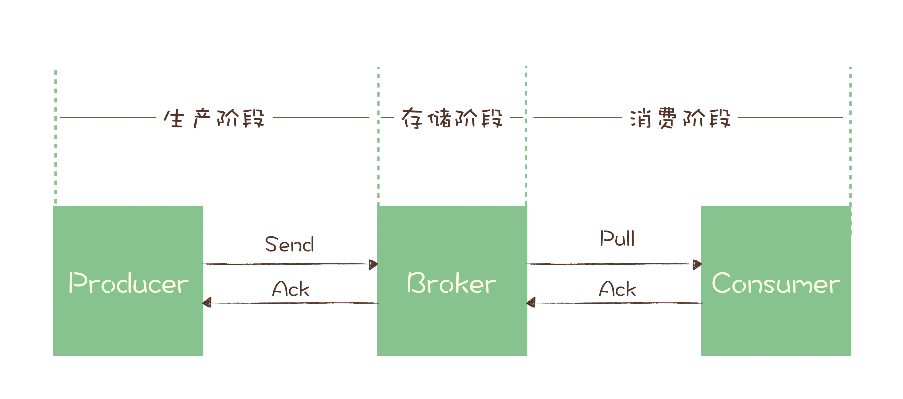

# 消息队列(二)
**4. 如何利用事务消息实现实现分布式事务**

**5. 如何保证消息不丢**
- 消息生产消费三阶段
    - 生产阶段: 在这个阶段，从消息在 Producer 创建出来，经过网络传输发送到 Broker 端。
    - 存储阶段: 在这个阶段，消息在 Broker 端存储，如果是集群，消息会在这个阶段被复制到其他的副本上
    - 消费阶段: 在这个阶段，Consumer 从 Broker 上拉取消息，经过网络传输发送到 Consumer 上。

- 生产阶段
    - 请求确认机制，保证消息的可靠传递。生产者发送消息到 Broker，Broker 收到消息后，会给客户端返回一个确认响应，表明消息已经收到了。否则会重试，如果重试失败则跑出异常
- 存储阶段
    - 单节点broker, 可配置 Broker 参数，在收到消息后，将消息写入磁盘后再给 Producer 返回确认响应。
    - 集群broker, 配置至少将消息发送到 2 个以上的节点，再给客户端回复发送确认响应，通过消息复制保证消息可靠性。
- 消费阶段
    - 消费阶段采用确认机制来保证消息的可靠传递。客户端从 Broker 拉取消息后，执行用户的消费业务逻辑，成功后，才会给 Broker 发送消费确认响应。

**6. 消息队列的名词**
- broker

**7. 如何保证消息的有序消费**