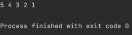

> 今天遇到一个问题，在Clang++下编译一段看上去略诡异的代码，想着还是整理一下sort的面经吧

```c++
    vector<int> a{1, 2, 3, 4, 5};
    sort(begin(a), end(a), [&](const auto & a, const auto & b){
        return true;
    });
    for (auto &i: a) {
        cout << i << ' ';
    }
    cout << endl;
```



虽然早知道sort是严格弱序，但是还是很好奇，为什么这样的代码能跑出来这样的输出，，
然后在MSVC下测试，发现编译器直接就报错了。
看来是个UB。

暂时还没了解清楚为什么Clang++会输出这样的结果，如果搞清楚了再补充


### sort的内部排序

`std::sort`是通过内省排序实现的，它有三种排序方式，分别是：堆排序，快速排序，插入排序

1. 针对大数据量，使用快速排序，时间复杂度是`O(nlogn)`

2. 若快排递归深度大于阈值`__depth_limit`，改用堆排序`partial_sort`，防止快排递归深度过深，同时保持时间复杂度仍是`O(nlogn)`

3. 当数据规模小于阈值`S_threshold`时，改用插入排序


### sort为什么要求严格弱序？

`std::__sort`主体上分为两个部分：

1. 首先，由`__introsort_loop`函数使得`[__first, __last)`区间在多个局部有序；

2. 其次，对第一步的结果，再进行一次插入排序`std::__final_insertion_sort`，保证整个`[__first, __last)`区间有序。


`__introsort_loop`函数是个递归函数，并且存在两个限制条件，或者说是递归基：

1. 每次递归时，`[__first, __last)`区间的元素个数必须大于`_S_threshold`：
   
   当不满足这个条件时，`__introsort_loop`函数就开始返回，这会导致元素个数小于阈值`_S_threshold`的小区间仍然是无序的。

2. 最大递归深度`__depth_limit`：
   
   当`__depth_limit==0`时，快排递归深度达到限制，为避免递归层数过深，STL就对当前的 `[__first, __last)` 区间进行堆排序。
   
   从另一个角度看，相当于通过 `__depth_limit` 限制条件，将`__introsort_loop`函数划分为快排、堆排两部分，而且不一定每次都会调用堆排，需要满足`__depth_limit`限制条件。

快排寻找分割位置使用了`__unguarded_partition_pivot`函数，这个函数**不提供越界检测**

，所以当传入数据相等时，`__unguarded_partition_pivot`的`last`指针有可能越界，导致`core dump`
