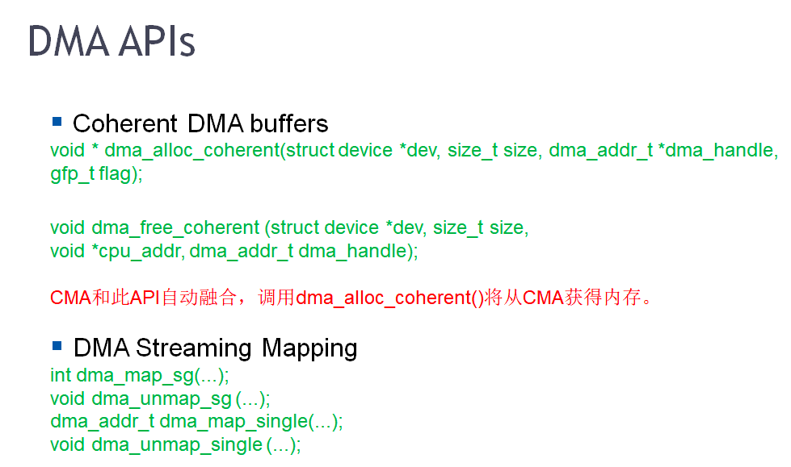

### DMA与cache一致性问题
工程中，DMA可以直接在内存和外设进行数据搬移，而CPU访问内存时要经过MMU。DMA访问不到CPU内部的cache，所以会出现cache不一致的问题。因为CPU读写内存时，如果在cache中命中，就不会再访问内存。

当CPU 写memory时，cache有两种算法：write_back ，write_through。一般都采用write_back。cache的硬件，使用LRU算法，把cache中的数据替换到磁盘。

cache一致性问题，主要靠以上两类api来解决这个问题。一致性DMA缓冲区api，和流式DMA映射api。CPU通过MMU访问DMA区域，在页表项中可以配置这片区域是否带cache。

现代的SoC，DMA引擎可以自动维护cache的同步。

### 内存的cgroup
进程分group，内存也分group。

进程调度时，把一组进程加到一个cgroup，控制这一组进程的CPU权重和最大CPU占用率。在/sys/fs/cgroup/memory创建一个目录，把进程放到这个group。可以限制某个group下的进程不用swap，每个group的swapiness都可以配置。

比如，当你把某个group下的swapiness设置为0，那么这个group下进程的匿名页就不允许交换了。
/proc/sys/vm/swapiness是控制全局的swap特性，不影响加到group中的进程。

也可以控制每个group的最大内存消耗为200M，当这个group下进程使用的内存达到200M，就oom。

demo: 演示用memory cgroup来限制进程group内存资源消耗的方法
```shell
swapoff -a
echo 1 > /proc/sys/vm/overcommit_memory  # 进程申请多少资源，内核都允许

root@whale:/sys/fs/cgroup/memory# mkdir A
root@whale:/sys/fs/cgroup/memory# cd A
root@whale:/sys/fs/cgroup/memory/A# echo $((200*1024*1024)) > memory.limit_in_bytes

cgexec -g memory:A ./a.out


[  560.618666] Memory cgroup out of memory: Kill process 5062 (a.out) score 977 or sacrifice child
[  560.618817] Killed process 5062 (a.out) total-vm:2052084kB, anon-rss:204636kB, file-rss:1240kB
```
