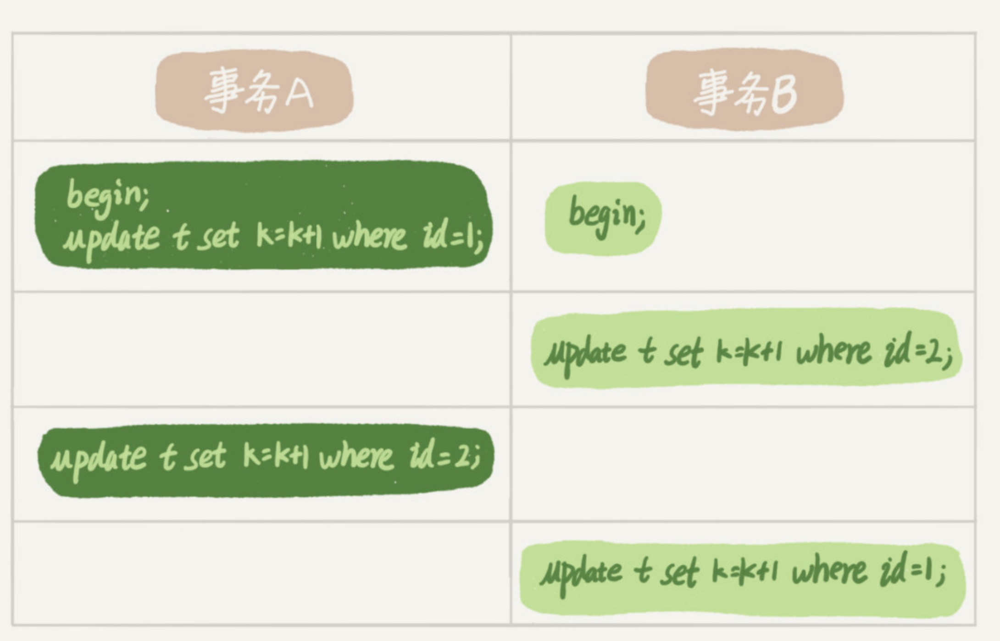

# MySQL面试题(三)

> 行锁相关

MySQL 的行锁是在引擎层由各个引擎自己实现的。但并不是所有的引擎都支持行锁，比如

MyISAM 引擎就不支持行锁。不支持行锁意味着并发控制只能使用表锁，对于这种引擎的

表，同一张表上任何时刻只能有一个更新在执行，这就会影响到业务并发度。InnoDB 是支

持行锁的，这也是 MyISAM 被 InnoDB 替代的重要原因之一。

### 两阶段锁协议

在 InnoDB 事务中，行锁是在需要的时候才加上的，但并不是不需要了就立刻

释放，而是要等到事务结束时才释放。

这就意味着如果事务中需要锁多个行，要把最可能造成锁冲突、最可能影响并发度的锁尽量往后放。

### 死锁与死锁检测

事务 A 在等待事务 B 释放 id=2 的行锁，而事务 B 在等待事务 A 释放 id=1 的行

锁。 事务 A 和事务 B 在互相等待对方的资源释放，就是进入了死锁状态。当出现死锁以

后，有两种策略：

一种策略是，直接进入等待，直到超时。这个超时时间可以通过参数

innodb_lock_wait_timeout 来设置。

另一种策略是，发起死锁检测，发现死锁后，主动回滚死锁链条中的某一个事务，让其他

事务得以继续执行。将参数 innodb_deadlock_detect 设置为 on，表示开启这个逻辑。

在 InnoDB 中，innodb_lock_wait_timeout 的默认值是 50s，意味着如果采用第一个策

略，当出现死锁以后，第一个被锁住的线程要过 50s 才会超时退出，然后其他线程才有可

能继续执行。对于在线服务来说，这个等待时间往往是无法接受的。

但是，我们又不可能直接把这个时间设置成一个很小的值，比如 1s。这样当出现死锁的时

候，确实很快就可以解开，但如果不是死锁，而是简单的锁等待呢？所以，超时时间设置太

短的话，会出现很多误伤。所以，正常情况下我们还是要采用第二种策略，即：主动死锁检测，而且

innodb_deadlock_detect 的默认值本身就是 on。主动死锁检测在发生死锁的时候，是能

够快速发现并进行处理的，但是它也是有额外负担的。

你可以想象一下这个过程：每当一个事务被锁的时候，就要看看它所依赖的线程有没有被别

人锁住，如此循环，最后判断是否出现了循环等待，也就是死锁。

那如果是我们上面说到的所有事务都要更新同一行的场景呢？

每个新来的被堵住的线程，都要判断会不会由于自己的加入导致了死锁，这是一个时间复杂

度是 O(n) 的操作。假设有 1000 个并发线程要同时更新同一行，那么死锁检测操作就是

100 万这个量级的。虽然最终检测的结果是没有死锁，但是这期间要消耗大量的 CPU 资

源。因此，你就会看到 CPU 利用率很高，但是每秒却执行不了几个事务。

**对于这种热点行更新导致的性能问题**，有两种解决思路：

1. 确保业务不会出现死锁，避免掉耗费大的死锁检测

2. 控制并发度

