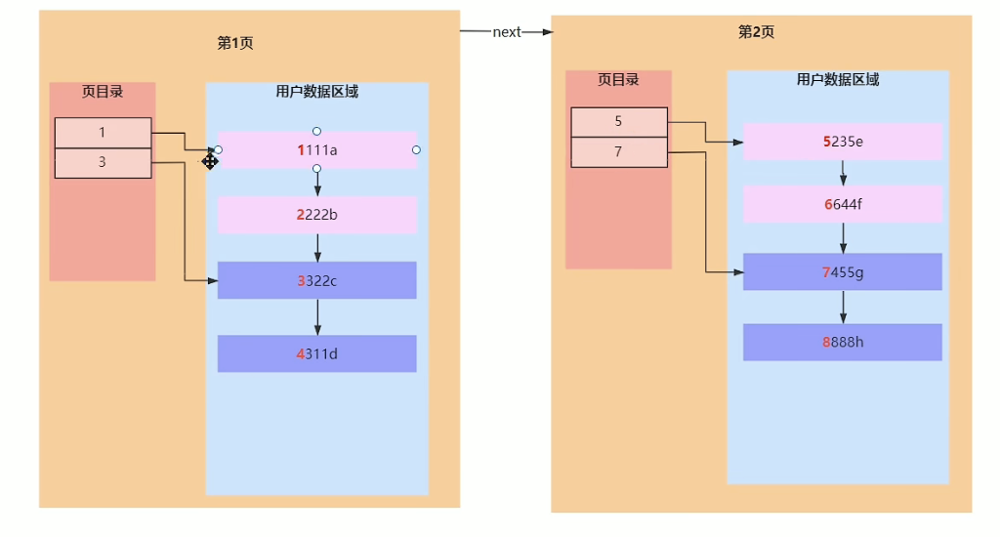
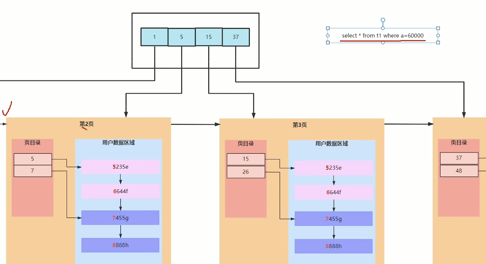
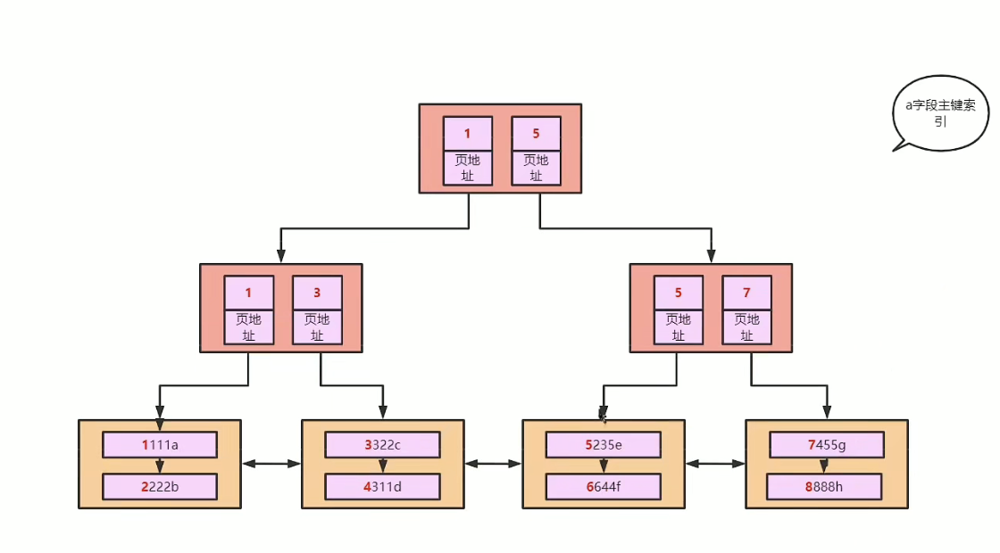
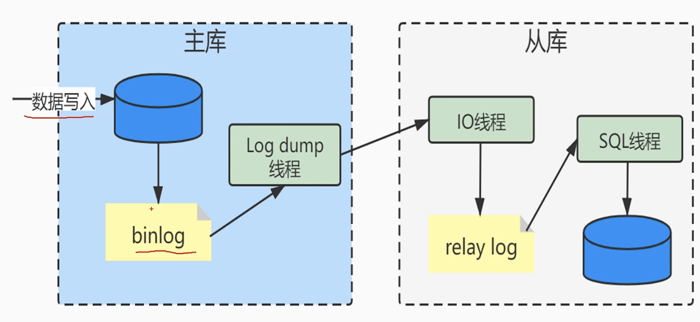

# MySQL高频面试题50题

> 大概50题吧，花了两三天时间重新整理了一遍

## 0. B+树与B树的区别？

1. B+树的非叶子结点存放的是索引，叶子结点存放索引以及数据；B树的非叶子结点存放的是索引和数据；这导致B+树在一次I/O中能读出的索引值实际上更多
2. B+树叶子节点通过链表串联，可以更好地进行范围查找，同时也可以更好地利用局部性原理（这是因为磁盘IO不是严格按需读取，而是每次都会预读，即便只需要一个字节，磁盘也会从这个位置开始，顺序向后读取一定长度的数据放入内存）

## **1.B+树是如何产生的？**


**磁盘I/O是一页一页去读的，MySQL一页的大小是16KB.操作系统一页是4KB**

InnoDB要求表必须有主键，如果没有显示指定，MySQL会自动选择一个可以唯一表示数据记录的列作为主键，如果不存在这种列，MySQL为InnoDB生成一个隐含字段作为主键

**为什么建议使用自增主键？**

- 整型比较是最简单的，字符串比较还需要诸位比较；并且字符串存储还需要更多的空间。
- hash索引仅能满足等值查询等，不支持范围查询实际生产中基本不用hash索引，这是因为hash索引可能存在hash碰撞
- 自增能保证索引分裂的概率较小。这样能保证因分裂导致的性能问题减小


**页的结构分布**

**(下图为B+树的叶子结点，B+树的结构是非叶子结点只存放索引，叶子结点存放索引以及用户数据）**



一棵二阶B+树的结构：





## 2.高度为3的B+树能存放多少数据？


**一页是16KB，对于一棵****二阶B+树**而言，非叶子结点，假设主键是int整型，4B，下一层的索引指针是6B，则实际上占用可能是10B

于是一页对应16KB/10B = 1638条索引。

再往下的叶子节点，假设一条记录存放了1KB的数据，则一页能存放（16KB/1KB)=16条记录。

于是对应的记录数是16 * 1638 = 26028（左右）条记录。

**对于一棵三阶B+树而言，**按照上面的计算方式还可以存1638 * 26028 ≈ 4千万条记录


所以一般高度为3的B+树对应的数据量已经到千万数量级了。


## 3.InnoDB是如何支持范围查找走索引的？


**InnoDB默认使用聚集索引，所谓聚集索引就是数据与索引存放在一起，于此相对应的还有非聚簇索引，这是另一种存储引擎Myisam使用的索引方式**


- 



- 对于主键可以走索引来快速查找，这个过程是通过根节点进行多路查找的。


- 但是，如果对于查询条件是非主键的情况，它不能走索引，只能从叶子节点开始做一次**全表扫描**（从上图中我们可以很清楚地看出，叶子结点通过链表串联起来，全表扫描便是这样从左到右去进行查找
- 对于走索引而言，如果查询条件是范围查询而非等值查询，会先进行等值查询，确定区间的端点，然后进行区间扫描。


## 4.为什么要遵循最左匹配原则才能使用索引？


首先厘清一下联合索引。是多关键字索引，比如说（a, b, c),这是一种非聚集索引（叶子节点存放的是主键值）

联合索引会创建一棵联合索引树，涉及联合索引的查询将会先去查询联合索引的B+树，该B+树的叶子节点数据部分存放的是对应的主键，然后得到主键之后**回表查询**主键索引树

**回表**：对于非主键索引，会先走一次普通索引对应的B+树，找到主键ID，然后再去查找主键B+树

`select * from t1 where c = 1 and b = 1 and a = 1;`

这条语句能否走索引？答案是可以，因此最左匹配原则是指所有字段的某个排列是否与联合索引的前缀匹配。

注意，`or`不会走索引

**索引下推：**

> https://segmentfault.com/a/1190000039869289 讲得很好
>
> https://blog.csdn.net/weixin_39785165/article/details/113166058 分层图示

是指MySQL发布的针对扫描二级索引的优化改进，总的来说是通过索引过滤条件下推到存储引擎


MySQL中ICP中涉及到的知识点：

1. MySQL server层：用来解析SQL的语法，语义，生成查询计划，接管从MySQL存储引擎层上推的数据进行二次过滤等等
2. MySQL存储引擎层：按照MySQL服务层下发的请求，通过索引或者全表扫描等方式把数据上传到MySQL服务层
3. MySQL索引扫描：根据指定索引过滤条件（比如where id=1)，遍历索引找到索引建对应的主键值后回表过滤剩余过滤条件
4. MySQL索引过滤：通过索引扫描并且基于索引进行二次条件过滤后再回表。

**ICP将索引扫描和索引过滤合并在一起处理，过滤后的记录数据下推到存储引擎后的一种索引优化策略。**他是先根据过滤条件中包含的索引键确定索引区间，再在这个区间的记录上使用包含索引键的其他过滤条件进行过滤，之后规避掉不满足的索引记录，只根据满足条件的索引记录回表取回数据上传到MySQL服务器。MySQL服务层对接收到的数据，使用where子句中不包含索引列的过滤条件做最后的过滤，然后返回数据给客户端。

这样做的优点如下：

1. 减少了回表的操作次数
2. 减少了上传到MySQL server层的数据


## 5. 范围查找导致索引失效原理分析

1. 不满足最左前缀原则（因为联合索引是按关键字排序的，只有满足前面的关键字有序，才能保证后续的关键字比较是有序的。
2. 在索引列上进行操作会导致索引失效从而导致全表扫描
3. 索引范围条件右边的列
4. 尽量使用覆盖索引而非*
5. 当使用*的时候使用!=, <>等
6. like以通配符开头
7. 字符串不加单引号
8. or连接的联表查询，这个时候使用union是一个很好的解决方法


## 6. MySQL数据库中，什么情况下设置索引但无法使用？

1. 不满足最左前缀原则
2. 字段进行了隐式数据类型转换
3. 此索引没有全表扫描效率高


## 7. 覆盖索引原理

**覆盖索引**：一个索引覆盖所有需要查询的字段的值。

因此可以避免回表

**如何实现覆盖索引：**将被查询的字段，建立到联合索引中。


## 8. 索引扫描底层原理

`select b from t1;`

这条语句会走索引，只是，它没有从树的根节点开始往下遍历，而是从叶子节点开始遍历，但是相对于全表扫描而言，它通过索引条件制约，避免掉了盲找


## 9. order by为什么会导致索引失效

假如说在数据量不大的情况下，使用order by走索引有回表的消耗，而全表扫描不需要走索引，效率会更高。


## 10.MySQL类型转换

MySQL中会发生类型转换，比如说

`'a' = 0`，默认看待非数字字符为0，字符串123`看待为123，可以认为是`stoi(s)`

**对索引进行加法减法，类型转换很有可能导致不能走索引**


## 11. MySQL的存储引擎

MySQL使用插件式的存储引擎。

1. `InnoDB`, MySQL的默认事务型引擎，被设计用于处理大量的短期事务。
2. `MyISAM`，不支持事务和行级锁，而且崩溃后无法安全恢复，同时MyISAM对整张表加锁，很容易因为表锁的问题导致典型的性能问题
3. `Memory`，比MyISAM快一个数量级，数据文件存储在内存中，Memory表的结构在重启后还会保留，但数据会丢失，主要应用场景为：**查找或映射表，缓存周期性聚合数据的结果。保存数据分析中产生的中间数据**
4. `Archive`，只支持INSERT和SELECT操作，会缓存所有的写并利用zlib对插入的行进行压缩，所以比MyISAM的磁盘I/O更少。但是**每次SELCT查询都需要执行全表扫描，所以Archive更适合日志和数据采集类应用**
5. `CSV`引擎，将普通的CSV文件作为MySQL的表的进行处理，不支持索引。**可以作为一种数据交换的机制。**


## 12.MyISAM和InnoDB的区别

1. InnoDB支持事务，MyISAM不支持事务
2. InnoDB支持外键，MyISAM不支持
3. InnoDB是聚集索引，MyISAM是非聚集索引
4. InnoDB不保存表的具体行数，执行`select count(*) from table`时需要全表扫描。而MyISAM用一个变量保存了整个表的行数，执行上述语句时只需要读出该变量即可
5. InnoDB最小的锁粒度是行锁，MyISAM最小的锁粒度是表锁（并发访问受限）


## 13.数据表设计字段如何选择

1. **字段类型优先级：**
   - 整型 > data, time > enum char > varchar > blob, text

2. **可以选整型就不选字符串**
3. **尽量选择字段较小**
4. **尽量避免使用NULL**（不利用索引，也不利用查询。=null查询不到值）
5. **char与varchar选择**


## 14. VARCHAR(M)最多能存储多少数据

对于VARCHAR类型的列最多可以定义65535个字符。


## 15. 事务的基本特性

1. **原子性**，一个事务中的操作要么全部成功，要么全部失败
2. **一致性**，数据库总是从一个一致性的状态转换到另一个一致性的状态
3. **隔离性**，一个事务的修改在最终提交前，对其他事务是不可见的
4. **持久性**，一旦事务提交，所做的修改就会永久保存到数据库中


## 16. 事务并发可能引起的问题

1. **脏读。**读未提交的数据
2. **不可重复读。**在同一个事务中，前后两次读取的数据不一致的现象是不可重复读。事务B读取了两次数据资源，在这两次读取的过程中事务A**修改**了数据，导致事务B在这两次读取出来的数据不一致。
3. **幻读。**事务B前后读取同一个范围的数据，在事务B两次读取的过程中事务A**新增**了数据，导致事务B后一次读取到前一次查询没有看到的行。


## 17.MySQL各种索引

按字段特性分类可分为：**主键索引，普通索引，前缀索引**

1. **主键索引：**一张表只有一个主键索引，一般在表创建时就指定
2. **唯一索引：**建立在UNIQUE字段上的索引被称为唯一索引
3. **普通索引**：建立在普通字段上的索引
4. **前缀索引：**对字符类型字段的前几个字符或对二进制类型字段的钱几个bytes建立的索引，而非在整个字段上建索引。（前缀索引使索引更小更快，但也包含缺点：mysql无法利用前缀索引做order by和group by


## 18.三星索引

1. **一星：**一个查询相关的索引行是相邻的或者至少相距足够靠近的获得一星
2. **二星：**如果索引中数据顺序和查找中的排列顺序一致则获得二星
3. **三星：**如果索引中的列包含了查询中需要的全部列则获得三星

三星索引在实际的业务中如果无法同时达到，**一般认为第三颗星最重要**


## 19.如何提高insert的性能

1. **合并多条insert为一条**。主要原因是降低日志量和日志刷盘的数据量，频率，从而提高效率。通过合并SQL语句，同时也能减少SQL语句解析的次数，减少网络传输的I/O
2. **修改参数bulk_insert_bffer_size**，调大批量插入的缓存
3. **设置innodb_flush_log_at_trx_commit = 0**
4. **手动使用事务**，因为mysql默认是autocommit的，这样每插入一条数据，都会进行一次commit；因此为了减少创建事务的消耗，可以手动使用事务。


## 20.全局锁，共享锁，排它锁

1. **全局锁：**对整个数据库实例加锁，典型应用场景是做全库逻辑备份。
2. **共享锁：**又称读锁，是读取操作创建的锁，支持共享读，互斥写
3. **排它锁**：又称写锁，当某个事务对某一行加上了排它锁，只能由这个事务对其进行读写，其他事务只有在该事务释放锁之后才能读写或者加锁。


## 21. 死锁

操作系统的概念。

**如何查看死锁？**

使用命令`show engine innodb status`查看最近一次死锁

InnoDB Lock Monitor打开锁监控，每15秒输出一次日志。*使用完毕后建议关闭，否则会影响数据库性能*

**对待死锁常见的两种策略：**

通过`innodblockwait_timeout`来设置超时时间，一直等待直到超时；

发起死锁检测，发现死锁之后，主动回滚死锁中的某一个事务，让其他事务继续执行


## 22.MySQL实现主从同步

> 参考https://segmentfault.com/a/1190000023775512

在涉及网络的项目中，使用到MySQL一般都会采用主从复制，读写分离的架构。

主从复制，读写分离一般是一起使用的。目的是为了**提高数据库的并发性能。**



**主从复制的原理：**

1. 当Master结点进行insert，update，delete操作时，会按顺序写入binlog中
2. slave从库连接master主库，master有多少个slave就会创建多少个binlog dump线程
3. 当master节点的binlog发生变化时，binlog dump线程会通知所有的slave结点，并将相应的binlog内容推送给slave节点
4. I/O线程接收到binlog内容后，将内容写入本地的relay-log
5. SQL线程读取I/O线程写入的relay-log，并且根据relay-log的内容对数据库进行对应的操作

**主从复制实现：**

太长了，不敲了，在链接里头有

**读写分离实现：**

1. AOP，通过方法名判断，方法名中有get，select，query开头的则连接slave，其他连接master数据库
2. 现成框架：比如说`Apache ShardingSphere`

**主从复制，读写分离的缺点：**

从机是通过binlog日志从master同步数据的，如果存在网络延迟，从机就会出现延迟，那么就有可能出现master写入数据后，slave读取数据不一定能马上读出来


## 23.MySQL分库分表

> https://juejin.cn/post/6844903648670007310

对于互联网项目，使用MySQL主从同步，可以通过从库的水平扩展解决更多的读请求问题，但是当用户量级上来之后，**写请求越来越多**，单纯加一个主库是无法解决这个问题的，因为数据要保证一致性，写操作需要在多个master之间同步。

**分库分表可以对写操作进行切分**


**分库分表的方式：**

1. 垂直切分。如果是因为表多而数据多，采用垂直切分，**根据业务切分为不同的库**
2. 水平切分。如果是因为单张表的数据量太大，要用水平切分，**即把表的数据按某种规则切分为多张表，甚至多个库上的多张表**

3. **分库分表的顺序是先垂直分，后水平分**

（还能继续细说


## 24.MySQL聚簇索引与非聚簇索引的区别

> https://cloud.tencent.com/developer/article/1541265

都是B+树的数据结构。

**聚簇索引**是数据与索引放在一块。

**非聚簇索引**是数据与索引分开存储，索引结构的叶子节点指向数据的对应行，MyISAM通过key_buffer将索引先缓存到内存中，当需要访问数据时（通过索引访问数据），在内存中直接搜索索引，然后通过索引找到磁盘相应数据，这也是为什么索引不在key buffer命中时，速度慢的原因


**聚簇索引的优势**：

1. 由于行数据和叶子节点存储在一起，同一页中会有多条行数据，访问同一数据页不同行记录时，已经把也加载到了Buffer中，再次访问时，会在内存中完成访问，不必访问磁盘。
2. 辅助索引使用主键作为“指针”而非使用地址值的好处是，使用聚簇索引可以保证无论主键B+树的结点如何变化，辅助索引树都不受影响
3. 聚簇索引适合用于排序的场合，非聚簇索引不适合
4. 可以将相关数据保存在一起。


**聚簇索引的劣势：**

1. **维护索引很昂贵，特别是插入新行或者主键被更新导致分页时**


## 25.MySQL索引的数据结构，各自优劣

在MySQL中使用较多的索引有Hash索引，B+树索引等。

InnoDB默认索引为B+树索引

对于哈希索引而言，底层的数据结构就是哈希表。

在绝大多数单条记录**等值查询**时，可以选择哈希索引，查询性能最快；其余绝大部分场景，建议使用B+树索引

**哈希索引的缺点：**

1. 不支持范围查询
2. 没办法利用索引完成排序，以及不支持模糊查询
3. 不支持多列联合索引的最左匹配原则
4. B+树索引的关键字检索效率比较平均


## 26. 索引设计的原则？

目的：查询更快，占用空间更小

1. **索引最左匹配原则**
2. **为经常需要排序，分组操作的字段建立索引**
3. **为常作为查询条件的字段建立索引**
4. **限制索引的数目**
5. **尽量选择区分度高的列作为索引**
6. **索引列不能参与计算**
7. **扩展索引**
8. **条件带like**（注意右模糊匹配查询(abc%)会使用索引，而(%abc)和(%abc%)会放弃索引而使用全表扫描
9. **尽量使用数据量小的索引**


## 27. MySQL中锁的类型有哪些

> https://segmentfault.com/a/1190000023869573

基于锁的属性分类：共享锁，排他锁

基于锁的粒度分类：行级锁，表级锁，页级锁，记录锁，间隙锁，临键锁

基于锁的状态分类：意向共享锁，意向排他锁


**行锁：**

按行对数据进行加锁。InnoDB是通过给索引上的索引项加锁来实现的，InnoDB一定存在聚簇索引，行锁最终都会落到聚簇索引上，通过非聚簇索引查询的时候，先锁非聚簇索引，然后再锁非聚簇索引。如果一个where语句中既有聚簇索引，又有二级索引，则会先锁聚簇索引，再锁二级索引。由于是分布加锁的，因此可能会有死锁现象发生


**表锁：**

锁住整张表的锁，InnoDB并非使用表锁来锁住表，而是使用Next-key Lock来锁住整张表。


## 28.MySQL执行计划怎么看？

MySQL有一个关键字`explain`


| **列名**      | **含义**                                     |
| ------------- | -------------------------------------------- |
| id            | SELECT查询的序列标识符                       |
| select_type   | SELECT关键字对应的查询类型                   |
| table         | 用到的表名                                   |
| partitions    | 匹配的分区，对于未分区的表，值为NULL         |
| type          | 表的访问方法                                 |
| possible_keys | 可能用到的索引                               |
| key           | 实际用到的索引                               |
| key_len       | 所选索引的长度                               |
| ref           | 当使用索引等值查询时，与索引作比较的列或常量 |
| rows          | 预计要读取的行数                             |
| filtered      | 按表条件过滤后，留存的记录数的百分比         |
| Extra         | 附加信息                                     |

**id:**

SELECT标识符。当id相同时，执行顺序，自上而下；当id不同时，id值越大，优先级越高，执行优先级越高


**select_type:**

- SIMPLE，简单查询，不含union或者子查询
- PRIMARY：查询中如果包含子查询或者其他部分，外层的SELECT将被标记为PRIMARY
- SUBQUERY：子查询中的第一个SELECT
- UNION：在UNION语句中，UNION之后出现的SELECT
- DERIVED：在FROM中出现的子查询将被标记为DERIVED
- UNION RESULT：UNION查询的结果


**table：**

表示查询用到的表名


**type：**

查询执行的类型

所有值的顺序从最优到最差排序为：

system > const > eq_ref < ref > fulltext > ref_or_null > index_merge < unique_subquery > index_subquery > range > index > ALL


**key:**

表示MySQL实际上使用的索引，如果为NULL，表示未使用索引


**key_len:**

表示MySQL实际使用的索引的最大长度；当使用到联合索引时，有可能是多个列的长度和

**rows：**

rows列表示根据表统计信息及选用情况，大致估算出找到所需记录或所需读取的行数，数值越小越好


**Extra：**

常见的值见下：

- using filesort，在排序时使用了外部的索引排序，没有用到表内索引进行排序
- using temporary: MySQL需要创建临时表来存储查询的结果，常见于ORDER BY和GROUP BY
- using index: 表明查询使用了覆盖索引，不用回表，查询效率非常高
- using index condition: 表示查询优化器使用了索引下推特性
- using where: 表明查询优化器使用了where子句进行条件过滤。一般在没有使用到索引的时候会出现
- using join bufer(Block Nested Loop):连表查询方式
- using intersect: 表示and的各个索引的条件时，该信息表示是从处理结果获取交集

**当Extra列包含Using filesort 或 Using tempora时，MySQL的性能可能会存在问题，需要尽可能避免**


## 29. 在left join时，on 和 where的区别

**多表联结的类型**：

1. 左联结，联结结果保留左表的全部数据
2. 右联结，联结结果保留右表的全部数据
3. 内联结，取两个表的公共数据

**left join，on和where的区别：**

1. on条件是在生成临时表时使用的条件，他不管on中条件是否为真，都会返回左边表的记录。

2. where条件是在临时表生成好后，再对临时表进行过滤的条件。不满足就全部过滤掉


## 30.事务的基本特性和隔离级别

**基本特性：**ACID

1. **原子性**。
2. **一致性。**
3. **隔离性。**
4. **持久性。**

（详细内容见上）

**四个隔离级别：**

1. **read uncommit** 读未提交。也称脏读
2. **read commit** 读已提交，也称不可重复读（Oracle中默认的级别
3. **repeatable read** 可重复读（MySQL默认的隔离级别
4. **serializable** 串行，一般不会使用，他会给每一行读取的数据加锁，会导致大量超时和锁竞争的问题


## 31. 慢查询及优化

对于主键查询速度还是很慢可能是由于表数据量过大。

慢查询有三个方向：

1. 首先分析语句。看看是否加载了额外的数据。
2. 分析语句的执行计划。使得语句尽可能地命中索引
3. 对语句的优化已经无法进行的话，可以考虑表中的数据量是否过大，是的话进行横向切分或者纵向切分（分库分表）


## 32. ACID是如何保证的？

1. A原子性由undo log日志保证，他记录了需要回滚的日志信息，事务回滚时撤销已经执行成功的sql

2. C一致性由其他三大特性保证，程序代码要保证业务上的一致性

3. I隔离性由MVCC保证

4. D持久性由内存+redo log保证，mysql修改数据同时在内存和redo log记录这次操作，宕机的时候可以从redo log恢复

   ```sql
   InnoDB redo log 写盘，InnoDB事务进入prepare状态。
   如果前面prepare成功，binlog写盘，再继续将事务日志持久化到binlog，如果持久化成功，那么InnoDB事务进入commit状态（在redo log里写一个commit记录）
   ```

   redolog的刷盘在系统空闲时进行


## 33. 什么是MVCC？

多版本并发控制：读取数据时通过一种类似快照的方式将数据保存下来，这样读锁和写锁就不冲突了，不同的事务session会看到自己特定版本的数据，版本链。

MVCC只在READ COMMITTED 和 REPEATABLE READ（rc，rr）两种隔离级别下工作。

聚簇索引记录中有两个必要的隐藏列：

1. **trx_id:**用来存储每次对某条聚簇索引记录进行修改时的事务id
2. **roll_pointer:**每次对哪条聚簇索引记录有修改的时候，都会把老版本写入undo日志中。这个roll_pointer就是存了一个指针，指向这条聚簇索引记录的上一个版本的位置，通过它来获得上一个版本的记录信息。（注意插入操作的undo日志没有这个属性，因为它没有老版本）

**已提交读和可重复读的区别就在于它们生成ReadView的策略不同。**

开始事务时创建readview，readview维护当前活动的事务id，即未提交的事务id，排序生成一个数组。

访问数据，获取数据中的事务id（获取的是事务id最大的记录），对比readview：

1. readview在readview左边（比readview都小），可以访问（在左边意味着该事务已经提交）
2. 如果在readview右边（比readview都小），或者在readview中，不可访问，获取roll_pointer，取上一版本重新对比（在右边意味着，该事务在readview生成之后出现，在readview中意味着该事务还未提交）

已提交读隔离级别下的事务，在每次查询开始都会生成一个独立的readview，而可重复读隔离级别则在第一次读的时候生成一个readview，之后的读用之前的readview。

MySQL的MVCC通过版本链，实现多版本，可并发读-写，写-读。通过readview生成策略的不同实现不同的隔离级别


## 34. DENSE_RANK(), RANK(), ROW_NUMBER()的区别

对于一组排名的值：99 99 85 80 75

1. `DENSE_RANK`。会得到1，1， 2， 3， 4 。 不设置间隔
2. `RANK`，会得到1， 1,  3， 4， 5 。 固定设置间隔
3. `ROW_NUMBER`会得到1, 2, 3 ,4, 5 。不处理重复。

