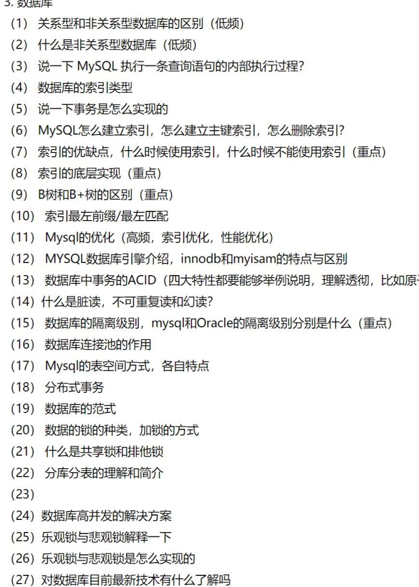

补充面试题：
1. 数据库中，什么情况下设置了索引会无法使用？
2. InnodB中的B+树如何产生？
3. 高度为3的B+树能够存放多少条记录？
4. InnodB如何支持范围查找能走索引？
5. 为什么要遵循最左匹配原则才能利用到索引？
6. 范围查找导致索引失效原理分析？
7. 覆盖索引的底层原理？
8. 索引扫描底层原理？
9. order by为什么会导致索引失效？
10. mysql中的数据类型转换有哪些需要注意的地方？
11. 对字段进行操作导致索引失效原理？
12. MySQL慢查询如何优化？
13. MySQL锁有哪些？如何理解？
14. Redis和MySQL如何保证数据一致
15. ACID靠什么保证？
16. Explain语句结果中各个字段分别代表什么？
17. MySQL聚簇索引和非聚簇索引的区别
18. MySQL索引结构，各自的优劣
19. mysql锁的类型有哪些？
20. MySQL执行计划怎么看？
21. MySQL主从同步原理
22. 存储拆分后如何解决唯一主键
23. 简述Myisam和InnodB的区别
24. 简述MySQL中索引类型以及对数据库的性能影响
25. 如何实现分库分表
26. MVCC是什么？
27. 事务的基本特性和隔离级别
28. 索引的基本原理
29. 索引的设计原则
30. 索引覆盖是什么？
31. 最多前缀原则是什么？
32. MySQL中有哪些存储引擎？
33. 数据表设计时，会选择哪些字段？
34. MySQL中VARCHAR(M)最多能存储多少数据？
35. 事务并发可能引发什么问题？
36. 简单描述一下MySQL各种索引？
37. 什么是三星索引？
38. InnoDB一棵B+树可以存放多少行数据？
39. 如何提高insert的性能？
40. 什么是全局锁，共享锁，排它锁？
41. 谈谈Mysql中的死锁？
42. 什么是脏读，幻读，不可重复读？

1.B+树是如何产生的？

磁盘I/O是一页一页去读的，MySQL一页的大小是16KB.操作系统一页是4KB

为什么建议使用自增主键？

整型比较是最简单的，字符串比较还需要诸位比较；并且字符串存储还需要更多的空间。
hash索引仅能满足等值查询等，不支持范围查询实际生产中基本不用hash索引，这是因为hash索引可能存在hash碰撞
自增能保证索引分裂的概率较小。这样能保证因分裂导致的性能问题减小

页的结构分布

(下图为B+树的叶子结点，B+树的结构是非叶子结点只存放索引，叶子结点存放索引以及用户数据）

视频中最后画出了一棵二阶B+树的结构：

2. 高度为3的B+树能存放多少数据？

一页是16KB，对于一棵二阶B+树而言，非叶子结点，假设主键是int整型，4B，下一层的索引指针是6B，则实际上占用可能是10B

于是一页对应16KB/10B = 1638条索引。

再往下的叶子节点，假设一条记录存放了1KB的数据，则一页能存放（16KB/1KB)=16条记录。

于是对应的记录数是16 * 1638 = 26028（左右）条记录。

对于一棵三阶B+树而言，按照上面的计算方式还可以存1638 * 26028 ≈ 4千万条记录

所以一般高度为3的B+树对应的数据量已经到千万数量级了。

3.InnoDB是如何支持范围查找走索引的？

InnoDB默认使用聚集索引，所谓聚集索引就是数据与索引存放在一起，于此相对应的还有非聚簇索引，这是另一种存储引擎Myisam使用的索引方式

对于主键可以走索引来快速查找，这个过程是通过根节点进行多路查找的。

但是，如果对于查询条件是非主键的情况，它不能走索引，只能从叶子节点开始做一次全表扫描（从上图中我们可以很清楚地看出，叶子结点通过链表串联起来，全表扫描便是这样从左到右去进行查找
对于走索引而言，如果查询条件是范围查询而非等值查询，会先进行等值查询，确定区间的端点，然后进行区间扫描。

4.为什么要遵循最左匹配原则才能使用索引？

首先厘清一下联合索引。是多关键字索引，比如说（a, b, c)

联合索引会创建一棵联合索引树，涉及联合索引的查询将会先去查询联合索引的B+树，该B+树的叶子节点数据部分存放的是对应的主键，然后得到主键之后回表查询主键索引树

·select * from t1 where c = 1 and b = 1 and a = 1;·（B站似乎有个奇怪的Bug，不能直接保存一段代码）

这条语句能否走索引？答案是可以，因此最左匹配原则是指所有字段的某个排列是否与联合索引的前缀匹配。

