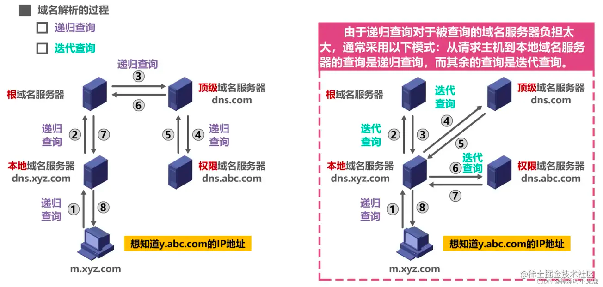

> 参考： https://juejin.cn/post/7025891022852849671
> https://juejin.cn/post/7065238621866950693
## 从页面输入URL到显示页面

1. DNS解析

    - 如果客户端的DNS缓存中存在该域名与IP地址的映射则直接解析，如果没有会查询本机的hosts文件看是否存在，还没有的话就会发生下面的事情

    - 首先执行域名解析，用户PC的DNS进程会发送一个DNS查询请求报文，该报文需要使用传输层的UDP协议封装成UDP用户数据报，DNS服务器的目的端口是53，这是约定俗成的
    - 首先客户端先向本地DNS服务器查询是否存在于缓存中，没有的话，本地DNS服务器将替客户端去向根域名服务器发起DNS查询。
    - 注意：由于通常递归查询对于被查询的服务器而言负担过大，因此一般只有本地DNS服务器与客户端之间的查询是递归查询，其余都是迭代查询。迭代查询与递归查询的区别在于每次查询到下一层的域名服务器时返回给本地DNS服务器还是继续在下一层往下递归

2. TCP连接（经历TCP三次握手过程）
   - 客户端发送TCP连接请求数据包，该数据包的SYN=1，随机选择一个序列号seq为x，后进入SYN_SENT状态（服务端一开始处于LISTEN状态
   - 服务端收到TCP连接请求后，进入SYN_RCVD状态,然后发送针对TCP连接请求的确认，该数据包的SYN=1，ACK = 1, ack=x+1,seq = y
   - 客户端收到TCP连接请求确认之后，进入ESTABLISHED状态，然后发送一个针对TCP连接请求的确认的确认给服务端，该数据包的ACK=1，seq=x+1,ack=y+1
   

3. 发起HTTP请求
   - HTTP请求是关于页面信息的请求，该部分请求报文使用TCP协议的，目的端口号是80
   
4. 服务端处理请求
5. 浏览器渲染
6. TCP断开连接（涉及TCP四次挥手过程）
   - 客户端（一般是客户端，主动发起连接关闭请求的一方），发起连接关闭请求报文，FIN=1，ACK1=1，seq=u，ack=v，进入FIN_WAIT_1状态
   - 服务端收到关闭连接报文后进入CLOSE_WAIT状态，发送确认报文，ACK=1，seq=v，ack=u+1，但是由于可能还有数据未能传输完成，因此后续还会再发送一个报文
   - 客户端收到报文后进入FIN_WAIT_2阶段
   - 后续准备好之后，服务端发送报文通知客户端自己已经传输好数据，该报文FIN=1，ACK=1，进入LAST_ACK状态，等待最后的ACK
   - 客户端收到报文后，发送一个该报文的ACK=1，ack=上一次收到的报文的seq+1，进入TIME_WAIT状态
   - 服务端收到报文后进入CLOSE状态
   - 客户端等待2MSL时间（最大报文生存时间后进入CLOSE状态，为什么设置TIME_WAIT状态？是为了允许旧的报文段在网络中消逝，以及保证TCP全双工连接的可靠终止，这是因为客户端发送
   的ACK可能丢失，服务器将重发最后的FIN）

## DNS的一些其他汇总

**高速缓存**

就是本地的浏览器DNS缓存，hosts文件，以及本地域名服务器的一些缓存，如果查询缓存存在的话，就不需要去做DNS请求了

**DNS只使用了UDP？**
- 当进行域名解析的时候，使用UDP协议
- 当进行区域传送的时候，使用TCP协议，区域传送是指一台备用服务器使用来自主服务器的数据刷新自己的域数据库，主要是做冗余备份，防止主服务器出现故障时dns解析不可用