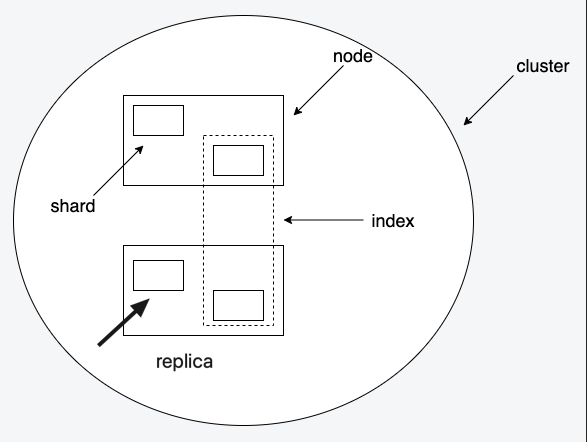
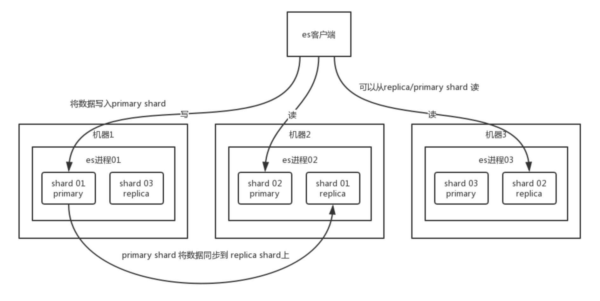
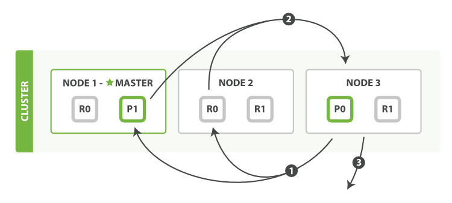

# ES总结(一)
> [ES常见面试题](https://mp.weixin.qq.com/s/sWKgSncV0GclDgY4dTS0og)
**1. es是干啥的？和关系型数据库类比和比较？用途**
- 是啥
    - Elasticsearch（ES）是一个分布式、可扩展、文档存储、实时的搜索与数据分析引擎。
    - Elasticsearch基于 Lucene，通过隐藏 Lucene 的复杂性，取而代之的提供一套简单一致的 RESTful API
- 类比关系型数据库
    | **RDS** | **ES** | **说明** |
    | --- | --- | --- |
    | database | index | 具有相似特点的文档的集合，可以对应为关系型数据库中的数据库，通过名字在集群内唯一标识 |
    | table | type | 索引内部的逻辑分类，可以对应为 Mysql 中的表，7.x之后type被废弃 |
    | row | doc | 构成索引的最小单元，属于一个索引的某个类别，从属关系为： Index -> Type -> Document，通过 id 在Type 内唯一标识 |
    | column | field | 构成文档的单元 |
    | schema | mapping | |
- 为何要使用es而不使用mysql
    - es具有强大的搜索能力，能够支持任何字段的各种形式的搜索。而mysql不具备此种能力
- es应用场景
    - 关系型数据库的补充、传统数据库的替代。如强大的全文检索功能
    - 站内搜索、垂直搜索
    - 记录和日志分析
    - 全文检索

**2. es的架构，如何实现分布式高可用？**
- ES集群概念
    | **名称** | **概念** | **说明** |
    | --- | --- | --- |
    | cluster | 集群 | 一个或多个 Node 的集合，ES 可以通过跨集群的备份，来提高服务稳定性 |
    | Node | 节点 | 运行 ES 的单个实例，保存数据并具有索引和搜索的能力，可以包含多个 Shard |
    | Shard | 分片 | 索引分为多个块，每块叫做一个 Shard。索引定义时需要指定分片数且不能更改（因为再分片相当于重建索引）|
    | Replica | 分片的备份	| 每个分片默认一个 Replica，它可以提升节点的可用性，同时能够提升搜索时的并发性能（搜索可以在全部分片上并行执行）|
- ES集群架构
    - 分片有主备，且分布在不同节点上，一个节点宕机，其他节点的备分片可以转为主分片
    - 有master节点，负责维护索引元数据、负责切换 primary shard 和 replica shard 身份等
        - 如果master 节点宕机了，那么会重新选举一个节点为 master 节点
        - 如果是非 master 节点宕机了，那么会由 master 节点，让那个宕机节点上的 primary shard 的身份转移到其他机器上的 replica shard。接着你要是修复了那个宕机机器，重启了之后，master 节点会控制将缺失的 replica shard 分配过去，同步后续修改的数据之类的，让集群恢复正常。
    
- es高可用的原理
    
**3. es搜索数据的过程？根据关键字搜索数据**
- 搜索被执行成一个两阶段过程，我们称之为 Query Then Fetch
    - 在初始查询阶段时，查询会广播到索引中每一个分片拷贝（主分片或者副本分片）。每个分片在本地执行搜索并构建一个匹配文档的大小为 from + size 的优先队列。
    - 每个分片返回各自优先队列中 所有文档的 ID 和排序值 给协调节点，它合并这些值到自己的优先队列中来产生一个全局排序后的结果列表。
    
    - 接下来就是 取回阶段，协调节点辨别出哪些文档需要被取回并向相关的分片提交多个 GET 请求。每个分片加载并 丰 富 文档，如果有需要的话，接着返回文档给协调节点。一旦所有的文档都被取回了，协调节点返回结果给客户端。
    

