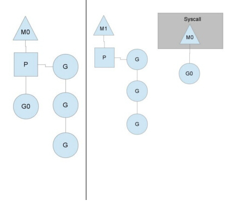

# Go基础(四)
**7. GPM调度模型**
> [go scheduler](https://morsmachine.dk/go-scheduler)
- G, P, M是什么?
    - G是Goroutine，每个Goroutine对象中的sched保存着其上下文信息。
    - 逻辑处理器,即为G和M的调度对象，用来调度G和M之间的关联关系，其数量可通过GOMAXPROCS()来设置，默认为核心数。
    - M是Machine(工作线程)，对Os内核级线程的封装，数量对应真实的CPU数（真正干活的对象）
    
- Go调度器和其他语言的调度有何不同？
    - 其他语言有进程和线程，但是没有协程，线程创建、切换上下文开销都比较大，进程开销更大。
    - go有协程，允许一个进程中创建几十万个协程，这是线程无法做到的，因此golang语言层面上就支持高并发。

- Go调度过程
    - 在单核情况下，所有Goroutine运行在同一个线程（M0）中，每一个线程维护一个上下文（P），任何时刻，一个上下文中只有一个Goroutine，其他Goroutine在runqueue中等待。一个Goroutine运行完自己的时间片后，让出上下文，自己回到runqueue中。
    - 多核情况下，会有多个M, 每个M会被一个P占据，P会有一个G队列，分配时间片依次执行这些G
    - 当运行的G0阻塞时(如IO)，内核线程M0也相应阻塞，此时挂在M上的P会转到新的M上去
    
    - 当M0返回时，它会尝试从其他线程中“偷”一个G过来，如果偷到，继续执行G0，如果没有偷到，会把Goroutine放到 Global runqueue中去，然后把自己放入线程缓存中。
    - 每个P会定时检查`Global runqueue`，若有G去过来挂到P上


**8. channel的工作原理**
- 为何需要channel
    - 通过channel，goroutine之间可以进行通信，一个goroutine可以获得另一个goroutine发来的数据
    - 借助channel，可以实现goroutine之间的并发控制
    - channel实际上是一个可并发读写的先进先出的队列
- channel用法
    - 定义channel
    ```go
    var c chan int
    ch := make(chan int)
    ```
    - 有向channel
    ```go
    sent chan<- int
    recieve <-chan int
    ```
    - select channel，哪个channel发来数据，就执行哪块逻辑
    ```go
    select {
    case res := <-someChannel:
        // do something
    case anotherChannel <- someData:
        // do something else
    case <- yetAnotherChannel:
        // do another thing
    }
    ```
    - buffered channel，有缓冲channel，当数据塞进capacity个时才会block
- 数据结构及原理实现简单说明
    - 创建channel, 写channel和读channel的底层实现见[channel实现原理](https://draveness.me/golang/docs/part3-runtime/ch06-concurrency/golang-channel/)
    ```go
    type hchan struct {
        qcount   uint //Channel 中的元素个数
        dataqsiz uint //Channel 中的循环队列的长度
        buf      unsafe.Pointer //Channel 的缓冲区数据指针
        elemsize uint16 //当前 Channel 能够收发的元素大小
        closed   uint32 // 是否close
        elemtype *_type //当前 Channel 能够收发的元素类型
        sendx    uint //Channel 的发送操作处理到的位置；
        recvx    uint //Channel 的接收操作处理到的位置
        recvq    waitq //等待接收数据的goroutine队列
        sendq    waitq //等待发送数据的goroutine队列

        lock mutex //channel保证可并发读写的锁
    }
    ```
    


**9. new和make的区别**
- new方法的参数为一个类型，可用于new 基本类型, struct, channel, array或者slice类型。获得的是类型的指针
- make创建的是slice, map, channel类型，返回的就是类型本身


**10. Golang反射**
- `reflect.TypeOf(var)` 和 `reflect.ValueOf(var)`是golang反射的两个重要函数，是普通对象转变为反射对象的方法
    - `reflect.TypeOf`获取了变量的类型信息，包括类型的方法、变量。reflect.Type是一个interface。通过 Method 方法获得类型实现的方法，通过 Field 获取类型包含的全部字段。对于不同的类型，我们也可以调用不同的方法获取相关信息：
        - 结构体：获取字段的数量并通过下标和字段名获取字段 StructField
        - 哈希表：获取哈希表的 Key 类型
        - 函数或方法：获取入参和返回值的类型
    - `reflect.ValueOf`获取了变量的运行时表示。reflect.Type是一个struct
- 三大法则
    - 从 interface{} 变量可以反射出反射对象。`reflect.TypeOf(var)` 和 `reflect.ValueOf(var)`的入参类型均为interface。
    
    - 通过`reflect.Value.Interface`可以从反射对象获得interface类型的变量，若要还原为原始变量，需要进行显示类型转换。
    
    - 要修改反射对象，其值必须可设置；若可设置，可通过
        - 调用 reflect.ValueOf 获取变量指针
        - 调用 reflect.Value.Elem 获取指针指向的变量
        - 调用 reflect.Value.SetInt 更新变量的值

- reflect.TypeOf实现原理。
    - 先将interface对象转为emptyInterface对象，再取出rtype类型指针，强转为Type类型
    ```go
    type emptyInterface struct {
        typ  *rtype
        word unsafe.Pointer
    }
    func TypeOf(i interface{}) Type {
        eface := *(*emptyInterface)(unsafe.Pointer(&i))
        return toType(eface.typ)
    }
    func toType(t *rtype) Type {
        if t == nil {
            return nil
        }
        return t
    }
    ```
-  reflect.rtype.Implements 方法可以用于判断某些类型是否遵循特定的接口。
    ```go
    type CustomError struct{}
    func (*CustomError) Error() string {
        return ""
    }
    func main() {
        typeOfError := reflect.TypeOf((*error)(nil)).Elem()
        customErrorPtr := reflect.TypeOf(&CustomError{})
        customError := reflect.TypeOf(CustomError{})

        fmt.Println(customErrorPtr.Implements(typeOfError)) // #=> true
        fmt.Println(customError.Implements(typeOfError)) // #=> false
    }
    ```
- 使用golang 反射动态调用方法
    - 通过 reflect.ValueOf 获取函数 Add 对应的反射对象；
    - 调用 reflect.rtype.NumIn 获取函数的入参个数；
    - 多次调用 reflect.ValueOf 函数逐一设置 argv 数组中的各个参数；
    - 调用反射对象 Add 的 reflect.Value.Call 方法并传入参数列表；
    ```go
    func Add(a, b int) int { return a + b }

    func main() {
        v := reflect.ValueOf(Add)
        if v.Kind() != reflect.Func {
            return
        }
        t := v.Type()
        argv := make([]reflect.Value, t.NumIn())
        for i := range argv {
            if t.In(i).Kind() != reflect.Int {
                return
            }
            argv[i] = reflect.ValueOf(i)
        }
        result := v.Call(argv)
        if len(result) != 1 || result[0].Kind() != reflect.Int {
            return
        }
        fmt.Println(result[0].Int()) // #=> 1
    }
    ```


