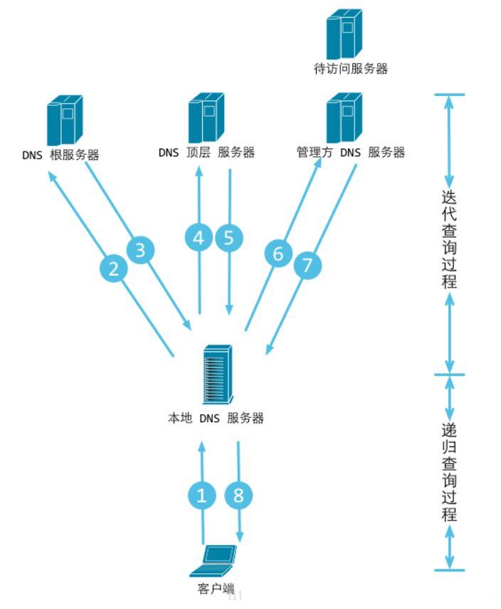
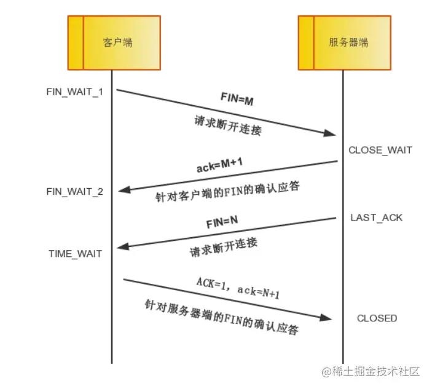
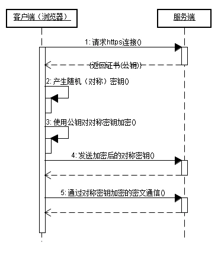

# 计算机网络

**1.计算机网络的各层协议及作用**

**2. DNS的工作流程**
- DNS是分级别解析出IP地址的
    - 根域名服务器： 只负责顶级域的解析；
    - 顶级域： .com、.gov（政府）、.cn（中国） .jp（日本）、 .kr（韩国）等通过域名后缀来分类
    - 二级域：下一级域
- 通过DNS获取IP地址(www.baidu.com)的流程
当访问一个域名时，请求就到了你的路由器(路由器可以解析DNS)，路由器就会向上去查找IP；
    - 请求根域，解析出顶级域(.com)的位置，返回给路由器；
    - 路由器去请求顶级域，顶级域可以解析出二级域(baidu.com)的地址，返回给路由器；
    - 路由器去请求二级域，二级域可以解析出下一级域(www.baidu.com)的地址，然后返回给路由器；
    - 路由器就可以把IP地址返回给浏览器了。
- 以上的每一级域的对应的IP，路由器都会做缓存，只要有缓存就会直接返回，停止向上查找。当然，CDN整个解析的每一个过程都会有缓存，从浏览器到电脑再到路由器都会把每次的DNS解析结果缓存起来，从而加快浏览器响应速度，也间接的减轻了DNS各级域的压力。

**3. CDN的流程**

**4. ARP协议**

**5. 有了IP地址，为什么还要用MAC地址？**

**6. 说一下ping的过程**

**7. TCP与UDP有什么区别**

**8. TCP协议如何保证可靠传输**
- 应用数据被分割成 TCP 认为最适合发送的数据块。
- TCP 给发送的每一个包进行编号，接收方对数据包进行排序，把有序数据传送给应用层。
- 校验和：TCP 将保持它首部和数据的检验和。这是一个端到端的检验和，目的是检测数据在传输过程中的任何变化。如果收到段的检验和有差错，TCP 将丢弃这个报文段和不确认收到此报文段。
- TCP 的接收端会丢弃重复的数据。
- 流量控制：TCP 连接的每一方都有固定大小的缓冲空间，TCP的接收端只允许发送端发送接收端缓冲区能接纳的数据。当接收方来不及处理发送方的数据，能提示发送方降低发送的速率，防止包丢失。TCP 使用的流量控制协议是可变大小的滑动窗口协议。 （TCP 利用滑动窗口实现流量控制）
- 拥塞控制：当网络拥塞时，减少数据的发送。
- ARQ协议：也是为了实现可靠传输的，它的基本原理就是每发完一个分组就停止发送，等待对方确认。在收到确认后再发下一个分组。
超时重传：当 TCP 发出一个段后，它启动一个定时器，等待目的端确认收到这个报文段。如果不能及时收到一个确认，将重发这个报文段。

**9. TCP的三次握手及四次挥手**
- 三次握手流程

    - 为什么需要三次握手？
        - 如果server发出确认报文就建立连接，可能server确认的是很早以前的client请求，client收到server的ack之后不会再确认，server白白浪费一个连接的资源。
- 四次挥手流程

    - 第一次挥手： Client端发起挥手请求，向Server端发送标志位是FIN报文段，设置序列号seq，此时，Client端进入FIN_WAIT_1状态，这表示Client端没有数据要发送给Server端了。
    - 第二次分手：Server端收到了Client端发送的FIN报文段，向Client端返回一个标志位是ACK的报文段，ack设为seq加1，Client端进入FIN_WAIT_2状态，Server端告诉Client端，我确认并同意你的关闭请求。
    - 第三次分手： Server端向Client端发送标志位是FIN的报文段，请求关闭连接，同时Client端进入LAST_ACK状态。
    - 第四次分手 ： Client端收到Server端发送的FIN报文段，向Server端发送标志位是ACK的报文段，然后Client端进入TIME_WAIT状态。Server端收到Client端的ACK报文段以后，就关闭连接。此时，Client端等待2MSL的时间后依然没有收到回复，则证明Server端已正常关闭，那好，Client端也可以关闭连接了。
    - 为啥四次挥手？
        - 一方发送断开连接请求后，另一方ack。但此时另一方仍可能在给己方传数据，需要等到传完，另一方也需要给己方发断开连接请求。
            - 类似于，甲乙互传文件，甲给乙传完文件后发出传完消息。但乙仍可能在给甲传文件，需要乙传完数据并给甲发消息甲确认之后
    - 为啥等待2MSL？
        - 为啥等？如果client的ACK报文如果在网络中丢掉，sever再次重发SYN给client， 那么此时client已经关掉，server无法close掉。
        - 为啥等2MSL？。MSL是报文段最大生存时间。如果没有2MSL, 客户端重新向server建立连接，客户端上这次的端口和前一次端口可能一致，前一次连接在网络滞留的数据

**10. HTTP 与 HTTPS 的区别**
- 概念
    - HTTP：是互联网上应用最为广泛的一种网络协议，是一个客户端和服务器端请求和应答的标准（TCP），用于从WWW服务器传输超文本到本地浏览器的传输协议，它可以使浏览器更加高效，使网络传输减少。
    - HTTPS：是以安全为目标的HTTP通道，简单讲是HTTP的安全版，即HTTP下加入SSL层，HTTPS的安全基础是SSL，因此加密的详细内容就需要SSL。
- HTTPS和HTTP的区别
    - https协议需要到ca申请证书，一般免费证书较少，因而需要一定费用。
    - http是超文本传输协议，信息是明文传输，https则是具有安全性的ssl加密传输协议。
    - http和https使用的是完全不同的连接方式，用的端口也不一样，前者是80，后者是443。
    - http的连接很简单，是无状态的；HTTPS协议是由SSL+HTTP协议构建的可进行加密传输、身份认证的网络协议，比http协议安全。
**11. HTTPS的流程**
    - （1）客户使用https的URL访问Web服务器，要求与Web服务器建立SSL连接。
    - （2）Web服务器收到客户端请求后，会将网站的证书信息（证书中包含公钥）传送一份给客户端。
    - （3）客户端的浏览器收到证书后，验证证书的正确性。与Web服务器开始协商SSL连接的安全等级，也就是信息加密的等级。
    - （4）客户端的浏览器根据双方同意的安全等级，建立会话密钥，然后利用网站的公钥将会话密钥加密，并传送给网站。
    - （5）Web服务器利用自己的私钥解密出会话密钥。
    - （6）Web服务器利用会话密钥加密与客户端之间的通信。（通信的秘钥是对称密钥）
    

**12. 什么是对称加密与非对称加密**
- 对称加密。从明文加密成密文和从密文解密出明文，使用的是同一个密钥。
- 非对称加密。从明文加密成密文和从密文解密出明文，使用的是不同的密钥。如使用公钥加密，然后使用私钥解密。使用私钥加密，然后使用公钥解密。

**13. 常用HTTP状态码**
- 301	Permanently Moved:	被请求的资源已永久移动到新位置，新的URL在Location头中给出，浏览器应该自动地访问新的URL。301为永久重定向。
- 302	Found:	请求的资源现在临时从不同的URL响应请求。302为临时重定向。
- 200	OK:	表示从客户端发来的请求在服务器端被正确处理
- 304	Not Modified:	告诉浏览器可以从缓存中获取所请求的资源。
- 400	bad request:	请求报文存在语法错误
- 403	forbidden:	表示对请求资源的访问被服务器拒绝
- 404	not found:	表示在服务器上没有找到请求的资源
- 500	internal sever error:	表示服务器端在执行请求时发生了错误
- 503	service unavailable:	表明服务器暂时处于超负载或正在停机维护，无法处理请求

**14. 常见的HTTP方法**

**15. GET和POST区别**

**16. HTTP 1.0、HTTP 1.1及HTTP 2.0的主要区别是什么**
> HTTP/1.x 是基于文本的，只能整体去传；HTTP/2 是基于二进制流的，可以分解为独立的帧，交错发送
HTTP/1.x keep-alive 必须按照请求发送的顺序返回响应；HTTP/2 多路复用不按序响应
HTTP/1.x keep-alive 为了解决队头阻塞，将同一个页面的资源分散到不同域名下，开启了多个 TCP 连接；HTTP/2 同域名下所有通信都在单个连接上完成
HTTP/1.x keep-alive 单个 TCP 连接在同一时刻只能处理一个请求（两个请求的生命周期不能重叠）；HTTP/2 单个 TCP 同一时刻可以发送多个请求和响应

1. HTTP/1.0 —— 无状态无连接的应用层协议
- 无状态：服务器不跟踪不记录请求过的状态
- 无连接：浏览器每次请求都需要建立tcp连接
HTTP/1.0规定浏览器和服务器保持短暂的连接。浏览器的每次请求都需要与服务器建立一个TCP连接，服务器处理完成后立即断开TCP连接（无连接），服务器不跟踪每个客户端也不记录过去的请求（无状态）。无状态导致的问题可以借助cookie/session机制来做身份认证和状态记录解决。
然而，无连接特性将会导致以下性能缺陷：
- 无法复用连接。每次发送请求的时候，都需要进行一次TCP连接，而TCP的连接释放过程又是比较费事的。这种无连接的特性会导致网络的利用率非常低。
- 队头堵塞(head of line blocking)。由于HTTP/1.0规定下一个请求必须在前一个请求响应到达之前才能发送。假设一个请求响应一直不到达，那么下一个请求就不发送，就到导致阻塞后面的请求。

2. HTTP/1.1
- 长连接。HTTP/1.1增加了一个Connection字段，通过设置Keep-alive（默认已设置）可以保持连接不断开，避免了每次客户端与服务器请求都要重复建立释放TCP连接，提高了网络的利用率。如果客户端想关闭HTTP连接，可以在请求头中携带Connection:false来告知服务器关闭请求
- 支持请求管道化（pipelining）。基于HTTP/1.1的长连接，使得请求管线化成为可能。管线化使得请求能够“并行”传输。举个例子来说，假如响应的主体是一个html页面，页面中包含了很多img，这个时候keep-alive就起了很大的作用，能够进行“并行”发送多个请求。（注意这里的“并行”并不是真正意义上的并行传输，具体解释如下。）

**17. Session、Cookie和Token的主要区别**

**18. 在浏览器中输⼊url地址到显示主⻚的过程**
> 
- 简单版
    - 1、浏览器根据请求url 交给 DNS 域名解析，解析完成之后得到 Ip 地址，这个时候访问服务器。
    - 2、服务器交给后台处理完成返回数据，浏览器通过 nginx 接收 Html、css、js
    - 3、浏览器对加载的资源  Html、css、js进行解析建立相应数据结构。
    - 4、载入解析到的资源文件，渲染页面，完成加载。
- 详细版
    - 浏览器输入URL 之后
    - 浏览器会先查看缓存，有缓存了则加载缓存，如果没有则加载新资源如下：
        - 1、没缓存请求新数据，有缓存检验是否足够新，够新则直接客户端，不新则请求服务端。
        - 2、检验新鲜通常有两个Http头进行控制，Expires 和 Cache-Control: 区别在于，一个值为一个绝对时间表示缓存的新鲜与否，另一个则是以秒为单位计算出最大的新鲜值时间。
    - 浏览器解析URL获取协议，主机，端⼝，path
    - 浏览器组装⼀个HTTP（GET）请求报⽂
    - 浏览器获取主机ip地址，过程如下：
        - 浏览器缓存
        - 本机缓存
        - hosts⽂件
        - 路由器缓存
        - ISP DNS缓存
        - DNS递归查询（可能存在负载均衡导致每次IP不⼀样）
    - 打开⼀个socket与⽬标IP地址，端⼝建⽴TCP链接，三次握⼿如下：
        - 客户端发送⼀个TCP的SYN=1，Seq=X的包到服务器端⼝
        - 服务器发回SYN=1， ACK=X+1， Seq=Y的响应包
        - 客户端发送ACK=Y+1， Seq=Z
    - TCP链接建⽴后发送HTTP请求
    - 服务器接受请求并解析，将请求转发到服务程序，如虚拟主机使⽤HTTP Host头部判断请 求的服务程序
    - 服务器检查HTTP请求头是否包含缓存验证信息如果验证缓存新鲜，返回304等对应状态码
    - 处理程序读取完整请求并准备HTTP响应，可能需要查询数据库等操作
    - 服务器将响应报⽂通过TCP连接发送回浏览器
    - 浏览器接收HTTP响应，然后根据情况选择关闭TCP连接或者保留重⽤，关闭TCP连接的四 次握⼿如下：
        - 主动⽅发送Fin=1， Ack=Z， Seq= X报⽂
        - 被动⽅发送ACK=X+1， Seq=Z报⽂
        - 被动⽅发送Fin=1， ACK=X， Seq=Y报⽂
        - 主动⽅发送ACK=Y， Seq=X报⽂
    - 浏览器检查响应状态吗：是否为1XX，3XX， 4XX， 5XX，这些情况处理与2XX不同
    - 如果资源可缓存，进⾏缓存
    - 对响应进⾏解码（例如gzip压缩）
    - 根据资源类型决定如何处理（假设资源为HTML⽂档）
    - 浏览器渲染页面。不细说。

**19. 什么是跨域问题?如何解决**