# 分布式系统

一、分布式理论：
1. 什么是CAP理论？

- C是Consistency。client向分布式系统写入一个值之后，读操作必须返回该值。
- A是Availability。只要收到用户的请求，服务器就必须给出回应。
- P是Partition tolerance。大多数分布式系统都分布在多个子网络。每个子网络就叫做一个区（partition）。分区容错的意思是，区间通信可能失败。分布式系统中P不可避免。
CAP定理是指三样不可能同时满足，只能三选二。
- CA (Consistency + Availability)：关注一致性和可用性，它需要非常严格的全体一致的协议，比如“两阶段提交”（2PC）。CA 系统不能容忍网络错误或节点错误，一旦出现这样的问题，整个系统就会拒绝写请求，因为它并不知道对面的那个结点是否挂掉了，还是只是网络问题。唯一安全的做法就是把自己变成只读的。
- CP (consistency + partition tolerance)：关注一致性和分区容忍性。它关注的是系统里大多数人的一致性协议，比如：Paxos 算法 (Quorum 类的算法)。这样的系统只需要保证大多数结点数据一致，而少数的结点会在没有同步到最新版本的数据时变成不可用的状态。这样能够提供一部分的可用性。
- AP (availability + partition tolerance)：这样的系统关心可用性和分区容忍性。因此，这样的系统不能达成一致性，需要给出数据冲突，给出数据冲突就需要维护数据版本。Dynamo 就是这样的系统。

2. 什么是BASE理论？
- 基本可用（Basically Available）。分布式系统在出现不可预知故障的时候，允许损失部分可用性。
- 软状态（Soft State）。软状态也称为弱状态，和硬状态相对，是指允许系统中的数据存在中间状态，并认为该中间状态的存在不会影响系统的整体可用性，即允许系统在不同节点的数据副本之间进行数据听不的过程存在延时。
- 最终一致性（Eventually Consistent）。最终一致性强调的是系统中所有的数据副本，在经过一段时间的同步后，最终能够达到一个一致的状态。因此，最终一致性的本质是需要系统保证最终数据能够达到一致，而不需要实时保证系统数据的强一致性。


3. 什么是2PC?
- 两阶段提交协议。要么所有副本（备份数据）同时修改某个数值，要么都不更改，以此来保证数据的强一致性。

2PC 分为两个过程：
- 表决阶段：此时 Coordinator （协调者）向所有的参与者发送一个 vote request，参与者在收到这请求后，如果准备好了就会向 Coordinator 发送一个 VOTE_COMMIT 消息作为回应，告知 Coordinator 自己已经做好了准备，否则会返回一个 VOTE_ABORT 消息；
- 提交阶段：Coordinator 收到所有参与者的表决信息，如果所有参与者一致认为可以提交事务，那么 Coordinator 就会发送 GLOBAL_COMMIT 消息，否则发送 GLOBAL_ABORT 消息；对于参与者而言，如果收到 GLOBAL_COMMIT 消息，就会提交本地事务，否则就会取消本地事务。
2PC优缺点
- 优点：原理简洁清晰、实现方便；
- 缺点：同步阻塞、单点问题、某些情况可能导致数据不一致。

4. 什么是3PC?
三阶段提交协议（Three-Phase Commit， 3PC）最关键要解决的就是 Coordinator 和参与者同时挂掉导致数据不一致的问题，3PC 把在 2PC 中又添加一个阶段，这样三阶段提交就有：CanCommit、PreCommit 和 DoCommit 三个阶段。

- 阶段一 CanCommit
    - 事务询问：Coordinator 向各参与者发送 CanCommit 的请求，询问是否可以执行事务提交操作，并开始等待各参与者的响应；
    - 参与者向 Coordinator 反馈询问的响应：参与者收到 CanCommit 请求后，正常情况下，如果自身认为可以顺利执行事务，那么会反馈 Yes 响应，并进入预备状态，否则反馈 No。
- 阶段二 PreCommit
    - 执行事务预提交：如果 Coordinator 接收到各参与者反馈都是Yes，那么执行事务预提交：

        - 发送预提交请求：Coordinator 向各参与者发送 preCommit 请求，并进入 prepared 阶段；
        - 事务预提交：参与者接收到 preCommit 请求后，会执行事务操作，并将 Undo 和 Redo 信息记录到事务日记中；
        - 各参与者向 Coordinator 反馈事务执行的响应：如果各参与者都成功执行了事务操作，那么反馈给协调者 ACK 响应，同时等待最终指令，提交 commit 或者终止 abort，结束流程；
    - 中断事务：如果任何一个参与者向 Coordinator 反馈了 No 响应，或者在等待超时后，Coordinator 无法接收到所有参与者的反馈，那么就会中断事务。

        - 发送中断请求：Coordinator 向所有参与者发送 abort 请求；
        - 中断事务：无论是收到来自 Coordinator 的 abort 请求，还是等待超时，参与者都中断事务。
- 阶段三 doCommit
    - 执行提交
        - 发送提交请求：假设 Coordinator 正常工作，接收到了所有参与者的 ack 响应，那么它将从预提交阶段进入提交状态，并向所有参与者发送 doCommit 请求；
        - 事务提交：参与者收到 doCommit 请求后，正式提交事务，并在完成事务提交后释放占用的资源；
        - 反馈事务提交结果：参与者完成事务提交后，向 Coordinator 发送 ACK 信息；
        - 完成事务：Coordinator 接收到所有参与者 ack 信息，完成事务。
    - 中断事务：假设 Coordinator 正常工作，并且有任一参与者反馈 No，或者在等待超时后无法接收所有参与者的反馈，都会中断事务

        - 发送中断请求：Coordinator 向所有参与者节点发送 abort 请求；
        - 事务回滚：参与者接收到 abort 请求后，利用 undo 日志执行事务回滚，并在完成事务回滚后释放占用的资源；
        - 反馈事务回滚结果：参与者在完成事务回滚之后，向 Coordinator 发送 ack 信息；
        - 中断事务：Coordinator 接收到所有参与者反馈的 ack 信息后，中断事务。

5. 什么是ZAB协议？
- [ZAB-一致性算法
](https://houbb.github.io/2018/10/30/zab)
- 特点
    - 主从，只有主服务器能够写入。
    - 数据写入能够保证强一致性。采用类似于2PC的方法来执行写操作(区别在于在第一阶段follower发给ack时，只需要半数以上节点ack主节点就会commit)
    - 节点状态
        - looking。正在选主，不对外提供服务
        - following。从节点
        - leading。主节点
    - zab的四个阶段
        - 选举阶段。为了选出一个准leader。
        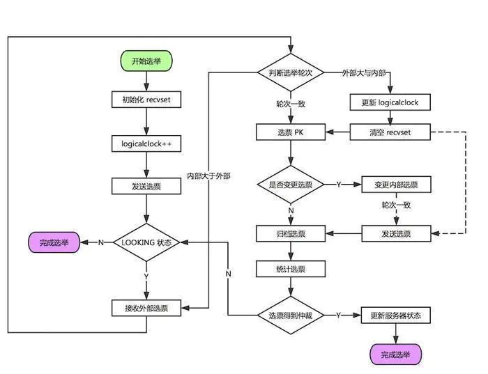
        
        - 发现阶段。发现当前大多数节点接收的最新 Proposal，并且准 Leader 生成新的 epoch，让 Followers 接收，更新它们的 acceptedEpochzab_decovery
        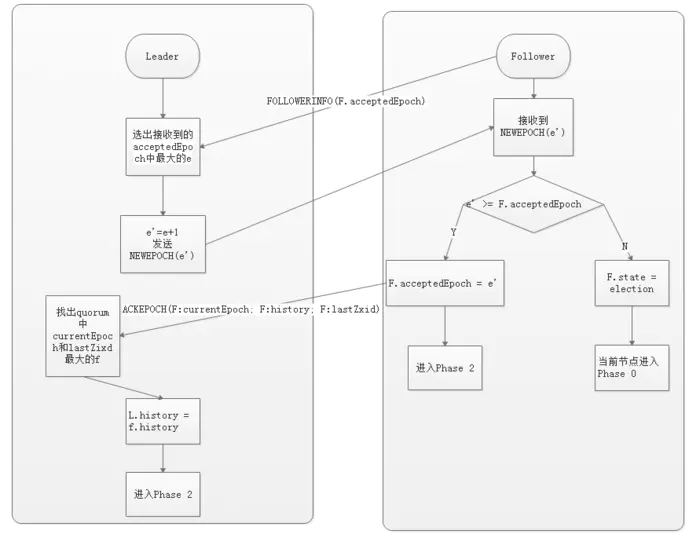
        - 同步阶段。利用 Leader 前一阶段获得的最新 Proposal 历史，同步集群中所有的副本。只有当 quorum（超过半数的节点） 都同步完成，准 Leader 才会成为真正的 Leader。Follower 只会接收 zxid 比自己 lastZxid 大的 Proposal。
        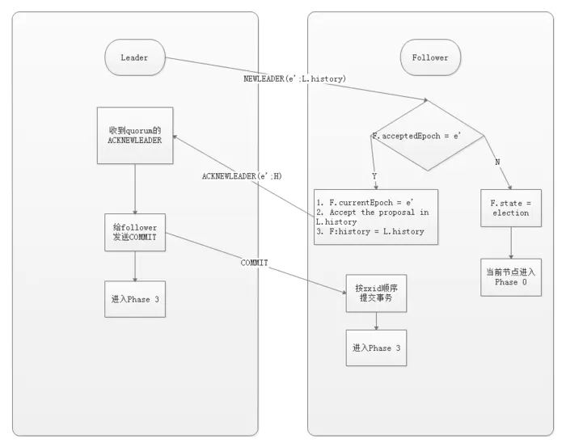
        - 广播阶段。Zookeeper 集群才能正式对外提供事务服务，并且 Leader 可以进行消息广播。同时，如果有新的节点加入，还需要对新节点进行同步。需要注意的是，Zab 提交事务并不像 2PC 一样需要全部 Follower 都 Ack，只需要得到 quorum（超过半数的节点）的Ack 就可以。
        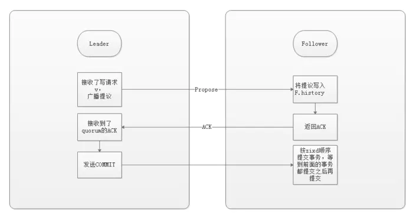

6. 什么是Raft协议？
- 参见[Raft共识算法](https://www.infoq.cn/article/coreos-analyse-etcd/)
- 动图见[raft可视化](http://thesecretlivesofdata.com/raft/#election)

7. 什么是Paxos算法？


8. 分布式选主算法比较
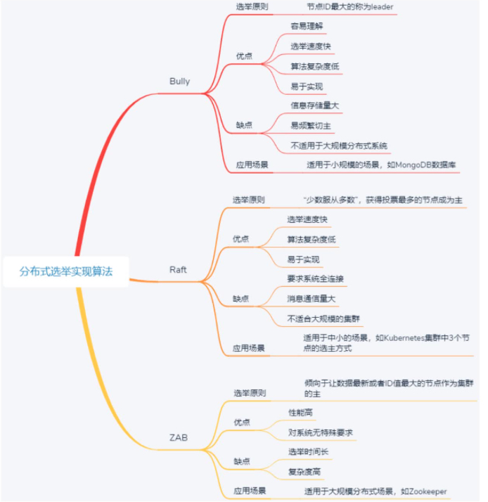

二、分布式锁

9. 什么是分布式锁？为何使用分布式锁？
- 锁是实现多线程同时访问统一共享资源，保证同一时刻只有一个线程可访问共享资源所做的一种标记。
- 分布式锁是指分布式环境下，系统部署在多个机器中，实现多进程分布式互斥的一种锁。
- 某些场景需要保证资源只能单个线程修改
    - 电商中大量用户购买扣减库存
    - 自己曾经参与的广告素材审核重构项目中，扣减送审quota

10. 分布式锁的实现

- 有三种主流方法。
    - 基于关系型数据库实现分布式锁。利用关系型数据库的unique key。
        - 加锁。往表中插入一条记录。如果有记录已经存在，则加锁失败
        - 解锁。删除此记录。
        - 存在缺点。单点故障(数据库不可用，整个系统崩溃)。死锁问题(插入记录的进程挂掉，将会产生死锁)。操作数据库很慢，且数据库承担并发有限，**不适合并发高、延时低的场景**
    - 基于缓存实现分布式锁。参考[redis分布式锁](https://redis.io/topics/distlock)
        - redis单机版
            - 加锁。`SET resource_name my_random_value NX PX 30000`
                - my_random_value为一个随机值，在解锁时需要用到。
                - NX，保证在没有`resource_name`key时才能设置(没有锁时才能加锁)。
                - PX，防止客户进程加锁后挂掉造成的死锁问题。
            - 锁释放。lua脚本保证原子性。
                ```
                if redis.call("get",KEYS[1]) == ARGV[1] then
                    return redis.call("del",KEYS[1])
                else
                    return 0
                end
                ```
            - 缺点
                - 由于超时时间导致锁被多 Client 同时获取。如客户进程A执行时间过长，导致锁过期后被客户进程B获取，导致A、B都认为自己获得了锁。
                - 异步的主从复制 & Master 宕机，导致锁丢失。如客户进程A获取锁A之后宕机，且未同步到
        - redis多机版。有有N个Redis主节点，N应该是一个大于2的奇数
            - 加锁。
                - 取得当前时间
                - 使用单节点获取锁的方式，依次获取 N 个节点的 Redis 锁。每个节点获取锁都有timeout, 超过timeout尝试下一个。
                - 如果获取到的锁的数量大于 `N/2+1` 个，且获取的时间小于锁的有效时间(lock validity time)就认为获取到了一个有效的锁，锁自动释放时间就是最初的锁释放时间减去之前获取锁所消耗的时间。
                - 如果获取锁的数量小于 `N/2+1` ，或者在锁的有效时间(lock validity time)内没有获取到足够的锁，就认为获取锁失败，这个时候需要向所有节点发送释放锁的消息。
            - 解锁。
                - 向所有的 Redis 节点发起释放的操作，无论该节点之前是否获取锁成功。
            - 解决锁过期造成的锁共用问题。为所增加一个自增标识。
            
    - 基于zookeeper实现分布式锁
        - 利用使用 ZK 的临时节点和有序节点实现
        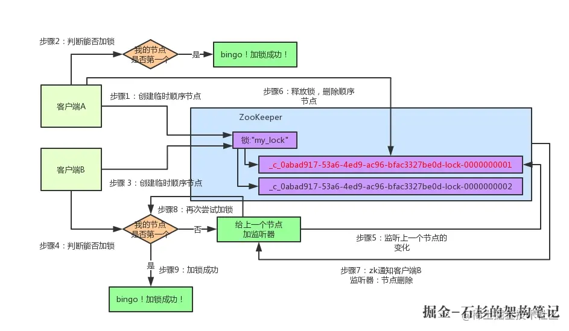
        - 缺陷
            - 羊群效应：当一个节点变化时，会触发大量的 watches 事件，导致集群响应变慢。每个节点尽量少的 watches，这里就只注册 前一个节点 的监听
            - ZK 集群的读写吞吐量不高
            - 网络抖动可能导致 Session 离线，锁被释放


三、分布式事务

11. 什么是分布式事务？为什么需要分布式事务
- 事务，其实是包含一系列操作的、一个有边界的工作序列，有明确的开始和结束标志，且要么被完全执行，要么完全失败。通常所说的事务是本地事务。
- 应用场景。
    - 对于网上购物的每一笔订单来说，电商平台一般都会有两个核心步骤：一是订单业务采取下订单操作，二是库存业务采取减库存操作。
    - 通常两个业务会运行在不同机器上，一笔订单，只有这两个操作都完成，才能算做处理成功，否则处理失败。


12. 分布式事务实现

- 三种方法
    - 基于 XA 协议的二阶段提交协议方法；
    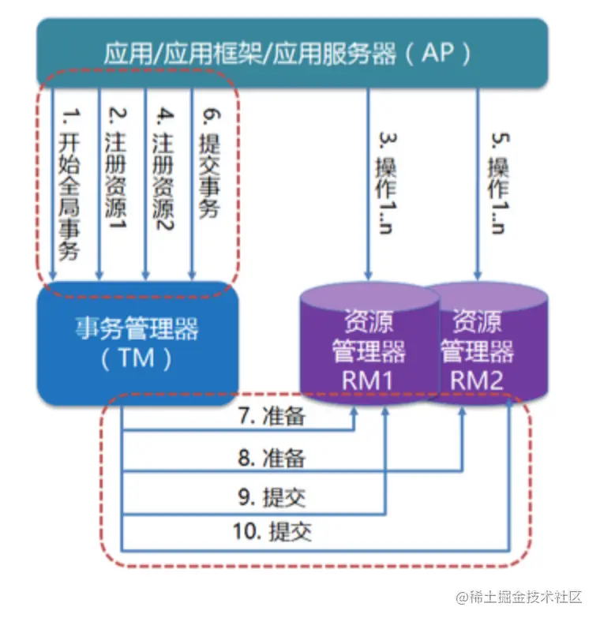
        - 缺点。
            - 同步阻塞。在二阶段提交的过程中直到 commit 结束为止，所有节点都需要等到其它节点完成后才能够释放事务资源
            - 单点问题：协调者（事务管理器）如果一旦出现故障那么整个服务就会不可用。
            - 数据不一致。如果说所有资源管理器都反馈的准备好了，这时候进入 commit 阶段，但是由于网络问题或者说某个资源管理器挂了，那么就会存在一部分机器执行了事务，另外一部分没有执行导致数据不一致
    - 三阶段提交协议方法；
    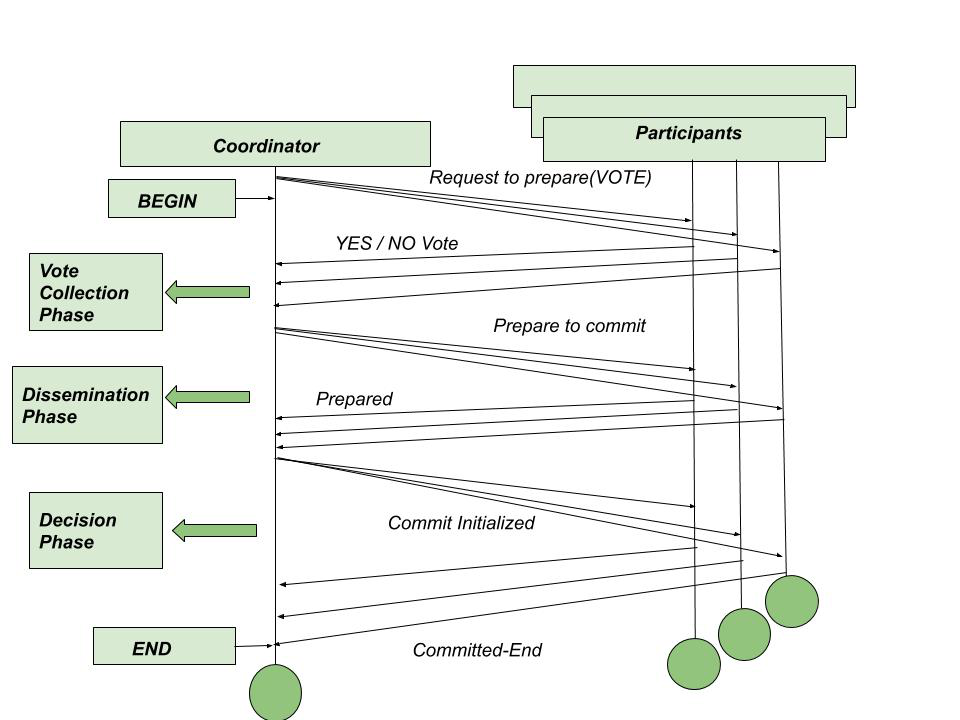
        - CanCommit。can_commmit有失败
            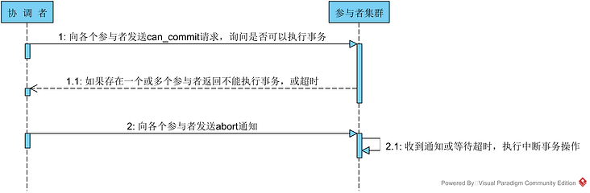
        - PreCommit。pre_commit有失败
            
        - DoCommit。全部成功
            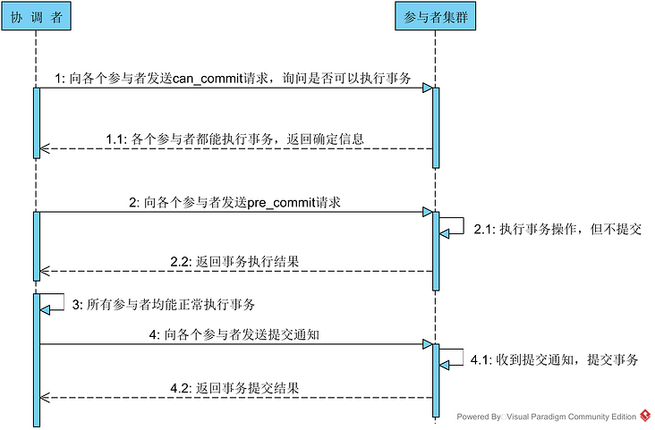
    - 基于消息的最终一致性方法。
        > 可参考[可靠消息最终一致性解决方案](https://juejin.cn/post/6844904143685959693)
        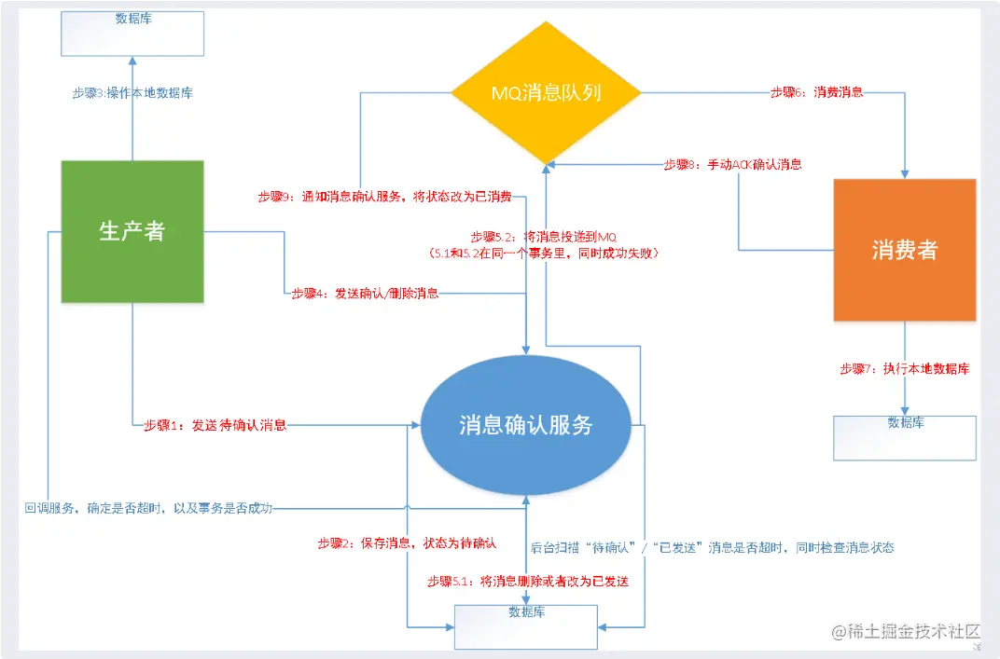
    
        - 生产者发送消息给消息确认服务器,消息确认服务器存储消息，并且把消息状态改为待确认。
        - 生产者发送消息后执行本地数据库，执行成功则确认消息，失败则删除消息。
        - 此时如果是确认消息，那么消息确认服务器就把数据库里的消息状态更新为“已发送”，同时将消息发送给MQ。5.1,5.2在一个事务中，要么都成功，要么都失败
        - 消费者一直等着从MQ消费消息，如果消费到了消息，那么就操作自己本地数据库
        - 如果操作成功了，就反过来通知消息确认服务器，说自己处理成功了，然后消息确认服务器就会把消息的状态设置为“已完成”。
        - 消息确认服务后台不断轮询自身数据库消息状态。如果待确认消息超时，则回调生产者提供的一个接口，确认生产者数据库操作状态，若上游执行成功，消息改为发送同时投递MQ，若上游执行失败，删除自身数据库消息。如果已提交消息超时，说明下游消费者消费发生问题，尝试重新投递MQ，让消费者再次执行，需要保证消费者消费的幂等性。
    - TCC强一致性方案。
        
        - 流程
            - Try 阶段：这个阶段说的是对各个服务的资源做检测以及对资源进行 锁定或者预留。
            - Confirm 阶段：这个阶段说的是在各个服务中执行实际的操作。
            - Cancel 阶段：如果任何一个服务的业务方法执行出错，那么这里就需要 进行补偿，就是执行已经执行成功的业务逻辑的回滚操作。（把那些执行成功的回滚）
        - 缺点
            - 事务回滚实际上是严重依赖于开发则写代码来回滚和补偿，会造成补偿代码巨大


