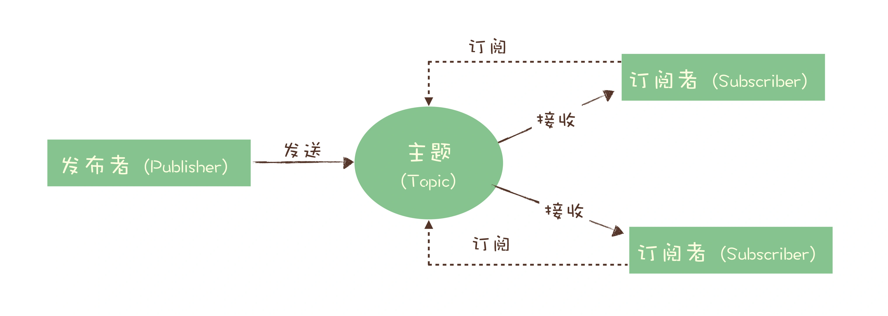
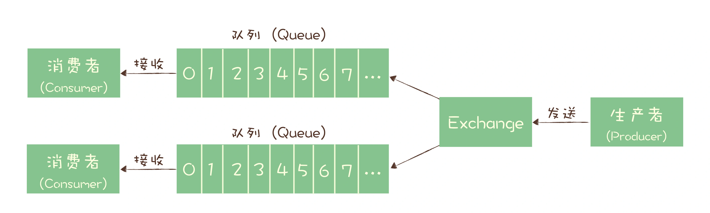
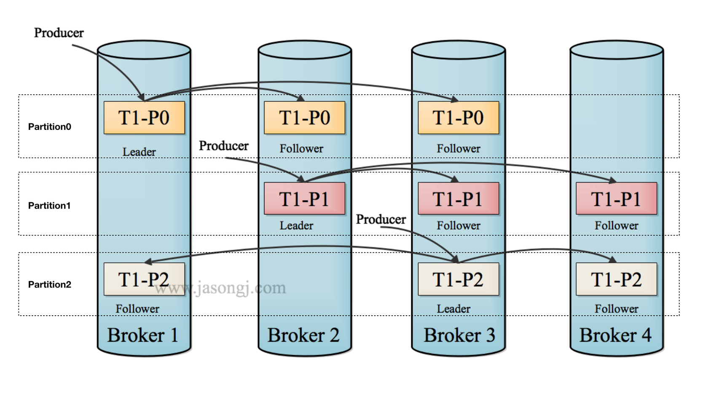

# 消息队列

> [消息队列kafka常见面试题](https://mp.weixin.qq.com/s/vSUQ2d0wo4mu7C-euzImYw)
**1. 举例说明消息队列的作用**
- 异步处理。更快返回结果，减少等待。
- 流量控制。
- 服务解耦。
- 作为发布 / 订阅系统实现一个微服务级系统间的观察者模式
- 连接流计算任务和数据
- 用于将消息广播给大量接收者。

**2. 常见消息队列比较**

消息队列需具备的特性
- 消息的可靠传递：确保不丢消息
- Cluster：支持集群，确保不会因为某个节点宕机导致服务不可用，当然也不能丢消息
- 性能：具备足够好的性能，能满足绝大多数场景的性能要求

几种消息队列的优缺点
| **消息队列** | **优点** | **缺点** |
| --- | --- | --- |
| RabbitMQ | 轻量易用 多种协议支持 灵活路由，通过exchange模块实现 健壮、稳定、易用、跨平台、支持多种语言、文档齐全 管理界面丰富社区活跃 | 对消息堆积支持差 性能有瓶颈，几万到十几万 erlang语言二次开发困难 |
| RocketMQ | 性能高，十万级单机吞吐量 分布式高可用 所有消息均持久化，零丢失 支持10亿级别消息堆积，可定制修改源码 | 支持的客户端语言不多 社区活跃度一般 | 
| Kafka | 性能卓越，单机写入TPS约在百万条/秒 分布式高可用 在大数据领域的实时计算以及日志采集被大规模使用 | 由于“攒一波再处理”导致延迟比较高 |

**3. 消息模型**

消息模型
- 队列模型
    - 同一队列消息的消费是互斥的，如果要多个消费者消费同一条消息，需要创建多个队列，并把这个消息发送到多个队列中
    
- 发布-订阅模型
    - 发布者发送一条消息给主题，可以被多个订阅该主题的消费者消费
    

常见消息队列的消息模型及实现
- RabbitMQ
    - 生产者并不关心将消息发送给哪个队列，而是将消息发送给 Exchange，具体发到哪个队列由Exchange配置
    - 同一份消息如果需要被多个消费者来消费，需要配置 Exchange 将消息发送到多个队列，每个队列中都存放一份完整的消息数据
    
- RocketMQ
    - 生产者将消息发送给broker, broker写入到主题或者队列中，消费者在收到消息之后完成消费业务逻辑并ack，broker确认这条消息一消费。
    - 消费者在消费组中，同一个消费组的消费者共享topic的消息，每个消费组可消费topic的全量消息。不同消费组的消费者消费消息互不影响。
    - 一个主题包含多个队列，通过多个队列来实现多实例并行生成和消费，同一个队列中消息的消费是有序的，主题层面无法保证消息的有序性。
    - 在 Topic 的消费过程中，由于消息需要被不同的组进行多次消费，所以消费完的消息并不会立即被删除，这就需要 RocketMQ 为每个消费组在每个队列上维护一个消费位置（Consumer Offset）
    
- Kafka
    - rocketmq中的队列在kafka中为partition，其他消费模型和rocketmq无区别。

**4. 如何利用事务消息实现实现分布式事务**

**5. 如何保证消息不丢**
- 消息生产消费三阶段
    - 生产阶段: 在这个阶段，从消息在 Producer 创建出来，经过网络传输发送到 Broker 端。
    - 存储阶段: 在这个阶段，消息在 Broker 端存储，如果是集群，消息会在这个阶段被复制到其他的副本上
    - 消费阶段: 在这个阶段，Consumer 从 Broker 上拉取消息，经过网络传输发送到 Consumer 上。

- 生产阶段
    - 请求确认机制，保证消息的可靠传递。生产者发送消息到 Broker，Broker 收到消息后，会给客户端返回一个确认响应，表明消息已经收到了。否则会重试，如果重试失败则跑出异常
- 存储阶段
    - 单节点broker, 可配置 Broker 参数，在收到消息后，将消息写入磁盘后再给 Producer 返回确认响应。
    - 集群broker, 配置至少将消息发送到 2 个以上的节点，再给客户端回复发送确认响应，通过消息复制保证消息可靠性。
- 消费阶段
    - 消费阶段采用确认机制来保证消息的可靠传递。客户端从 Broker 拉取消息后，执行用户的消费业务逻辑，成功后，才会给 Broker 发送消费确认响应。

**6. 消息队列的名词**
- broker
    - kafka集群包含一个或者多个服务器，服务器节点即为broker
- topic
    - 每条发布到Kafka集群的消息都有一个类别，这个类别被称为Topic。一个topic有多个partition，方便并发消费
- producer
    - 生产者即数据的发布者，该角色将消息发布到Kafka的topic中。生产者发送的消息，存储到一个partition中。
- consumer
    - 消费者。consumer可以选择一个topic，通过offset指定从哪个位置开始消费消息。下次消费保留此位置。
- partition
    - 一个topic中的消息可分区(partition存储)。使用partition可以提高提高消息吞吐量，提高可用性和可扩展性。
- replica
    - 为了保证高可用，同一条消息也会进行复制分布到多个机器上，副本称为replica。下图每条消息复制了三份。
    
- consumer group
    - 每个consumer 属于一个consumer group，每条消息只能被 consumer group 中的一个consumer 消费，但可以被多个consumer group 消费
    
- leader
    - broker集群是有主从的
    - 主从是保证分布式集群高可用和可扩展的一个要点
- follower
    

**7. 如何保证消息的有序消费**

**8.如何处理消费过程中的重复消息**

**9.消息积压了如何处理**

**10.消息队列如何实现高可用**

**11.如何保证消费者消费消息的幂等性**

**12.消息过期了如何处理**
- 分析原因
    - 消息队列都有消息生产消费速度监控。
    - 生产者发送变快。优化消费者代码(扩大并发，优化业务处理逻辑耗时)， 消费者扩容。
    - 消费者消费变慢。看看是否为消费线程卡住，是否为python消费者消费逻辑处理时间过程而无其他线程及时进行心跳同步(真实遭遇)
- 优化性能
    - 生产端
        - 只需要注意设置合适的并发和批量大小，就可以达到很好的发送性能。
        - 如果消息发送端是一个微服务，主要接受 RPC 请求处理在线业务，对时延要求高，就通过并发来提升发送性能。
        - 如果系统是一个离线分析系统，更适合批量发送
    - 消费端
        - 一定要保证消费端的消费性能要高于生产端的发送性能，这样的系统才能健康的持续运行。
        - 优化消费业务逻辑， 水平扩容，增加消费者并发
        - 在水平扩容时，必须同步扩容主题中的分区（也叫队列）数量，确保 Consumer 的实例数和分区数量是相等的。否则无效果，因为对于消费者来说，在每个分区上实际上只能支持单线程消费。

**13.消息队列存储方式**
- 分布式KV存储
    - 这类 MQ 一般会采用诸如 LevelDB 、RocksDB 和 Redis 来作为消息持久化的方式。由于分布式缓存的读写能力要优于 DB ，所以在对消息的读写能力要求都不是比较高的情况下，采用这种方式倒也不失为一种可以替代的设计方案。
- 文件系统
    - 目前业界较为常用的几款产品（RocketMQ / Kafka / RabbitMQ）均采用的是消息刷盘至所部署虚拟机/物理机的文件系统来做持久化（刷盘一般可以分为异步刷盘和同步刷盘两种模式）
- 关系型数据库 DB
    - Apache下开源的另外一款MQ—ActiveMQ（默认采用的KahaDB做消息存储）可选用 JDBC 的方式来做消息持久化，通过简单的 XML 配置信息即可实现JDBC消息存储。
    - 普通关系数据库有性能瓶颈，不适于作为高IO高性能消息队列的底层存储
**14.如何自己设计消息队列**
- 需了解技术的基本原理、核心组成部分、基本架构构成
- 首先这个 mq 得支持可伸缩性吧，就是需要的时候快速扩容，就可以增加吞吐量和容量，那怎么搞？设计个分布式的系统呗，参照一下 kafka 的设计理念，broker -> topic -> partition，每个 partition 放一个机器，就存一部分数据。如果现在资源不够了，简单啊，给 topic 增加 partition，然后做数据迁移，增加机器，不就可以存放更多数据，提供更高的吞吐量了？

- 其次你得考虑一下这个 mq 的数据要不要落地磁盘吧？那肯定要了，落磁盘才能保证别进程挂了数据就丢了。那落磁盘的时候怎么落啊？顺序写，这样就没有磁盘随机读写的寻址开销，磁盘顺序读写的性能是很高的，这就是 kafka 的思路。

- 其次你考虑一下你的 mq 的可用性啊？这个事儿，具体参考之前可用性那个环节讲解的 kafka 的高可用保障机制。多副本 -> leader & follower -> broker 挂了重新选举 leader 即可对外服务。

- 能不能支持数据 0 丢失啊？可以的，参考我们之前说的那个 kafka 数据零丢失方案。
