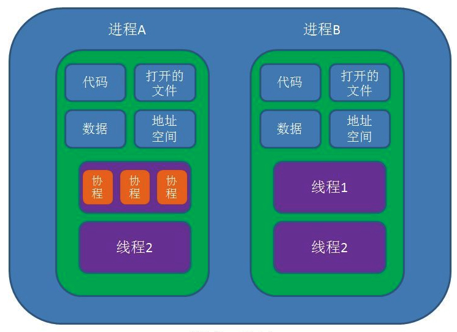
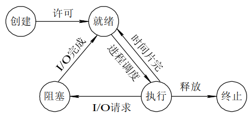
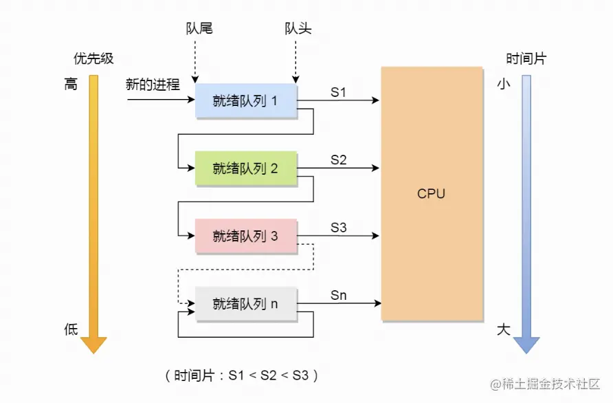
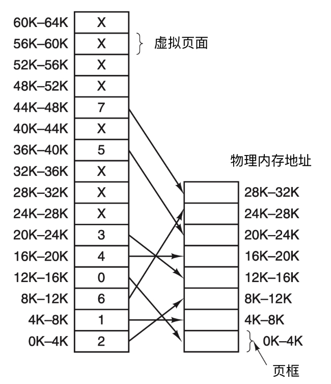
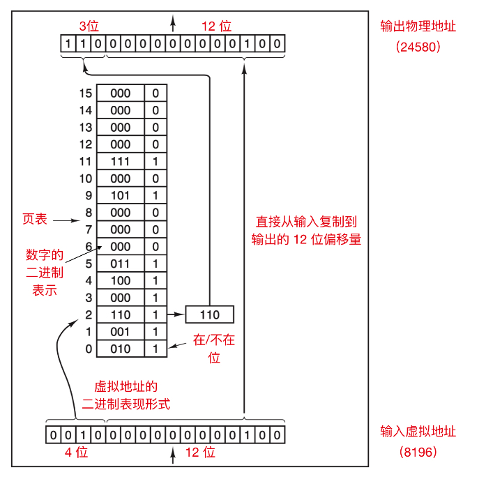

# 操作系统
**进程、线程与协程的区别**
> 参考[什么是协程，协程和线程的区别和联系？](https://segmentfault.com/a/1190000040373756)
- 线程本质就是堆栈，当一段程序在执行，能代表它的是他的过去和现在。过去 在堆栈中，现在 则是 CPU 的所有寄存器，如果我们要挂起一个线程，我们把寄存器也保存到堆栈中，我们就具有它的所有状态，可以随时恢复它。是独立调度的基本单位。

- 进程的本质是地址空间，当我们切换线程的时候，同时切换它的地址空间（通过修改MMU即可），则认为发生了进程切换。是资源分配的基本单位

- 协程本质上就是用户态下的线程，协程切换没有内核态用户态切换，因此开销小。

- 进程与线程的区别
> [进程与线程的一个简单解释](https://www.ruanyifeng.com/blog/2013/04/processes_and_threads.html)
    - 资源上，进程是资源分配的基本单位，但是线程不拥有资源，线程可以访问隶属进程的资源。
    - 调度上，线程是独立调度的基本单位，在同一进程中线程切换的话不会引起进程的切换，从一个进程中的线程切换到另一个进程中的线程时，会引起进程的切换。
    - 系统开销上，由于创建或撤销进程，系统都要分配回收资源，所付出的开销远大于创建或撤销线程时的开销。类似的，在进行进程切换的时候，涉及当前执行进程 CPU 环境的保存及新调度进程 CPU 环境设置，而线程切换只需保存和设置少量寄存器的内容，开销很小。
    - 通信上，线程间可以通过直接读写同一进程的数据进行通信，但是进程通信需要借助一些复杂的方法。
- 有了线程，为何还要协程？
    - 一是节省 CPU，避免系统内核级的线程频繁切换，造成的 CPU 资源浪费。好钢用在刀刃上。而协程是用户态的线程，用户可以自行控制协程的创建于销毁，极大程度避免了系统级线程上下文切换造成的资源浪费。
    - 二是节约内存，在 64 位的 Linux 中，一个线程需要分配 8MB 栈内存和 64MB 堆内存，系统内存的制约导致我们无法开启更多线程实现高并发。而在协程编程模式下，可以轻松有十几万协程，这是线程无法比拟的。
    - 三是稳定性，前面提到线程之间通过内存来共享数据，这也导致了一个问题，任何一个线程出错时，进程中的所有线程都会跟着一起崩溃。
    - 四是开发效率，使用协程在开发程序之中，可以很方便的将一些耗时的 IO 操作异步化，例如写文件、耗时 IO 请求等。

**并发与并行区别， 阻塞与非阻塞却别，同步与异步区别**
- 并发与并行
    - 并发就是在一段时间内，多个任务都会被处理；但在某一时刻，只有一个任务在执行。单核处理器可以做到并发。
    - 并行就是在同一时刻，有多个任务在执行。这个需要多核处理器才能完成，在微观上就能同时执行多条指令，不同的程序被放到不同的处理器上运行，这个是物理上的多个进程同时进行。

- 阻塞与非阻塞
    - 阻塞与非阻塞是对同一个线程来说的，在某个时刻，线程要么处于阻塞，要么处于非阻塞。阻塞和非阻塞关注的是程序在等待调用结果（消息，返回值）时的状态：阻塞调用是指调用结果返回之前，当前线程会被挂起。调用线程只有在得到结果之后才会返回。非阻塞调用指在不能立刻得到结果之前，该调用不会阻塞当前线程。

- 同步与异步
    - 同步与异步是对应于调用者与被调用者，它们是线程之间的关系，两个线程之间要么是同步的，要么是异步的。同步操作时，调用者需要等待被调用者返回结果，才会进行下一步操作。而异步则相反，调用者不需要等待被调用者返回调用，即可进行下一步操作，被调用者通常依靠事件、回调等机制来通知调用者结果

**系统调用 / 用户态和内核态**
- 什么是系统调用？
    - 系统调用(System call)是程序向系统内核请求服务的方式。可以包括硬件相关的服务(例如，访问硬盘等)，或者创建新进程，调度其他进程等。系统调用是程序和操作系统之间的重要接口。
- 为什么要有系统调用？
    - 用户程序随意直接访问修改数据和系统关键信息是非常危险的，访问网卡、磁盘中的数据须由内核的例程访问比较安全。通过内核的例程操作计算机的关键数据就是系统调用。
- 用户态和内核态？
    - 内核态：处于内核态的 CPU 可以访问任意的数据，包括外围设备，比如网卡、硬盘等，处于内核态的 CPU 可以从一个程序切换到另外一个程序，并且占用 CPU 不会发生抢占情况，一般处于特权级 0 的状态我们称之为内核态。
    - 用户态：处于用户态的 CPU 只能受限的访问内存，并且不允许访问外围设备，用户态下的 CPU 不允许独占，也就是说 CPU 能够被其他程序获取。

**有哪些系统调用**
- 使用软件中断（Software interrupt）触发系统调用；
- 使用 SYSCALL / SYSENTER 等汇编指令触发系统调用；
- 使用虚拟动态共享对象（virtual dynamic shared object、vDSO）执行系统调用；

**如何从用户态切换到内核态**
- 应用程序 在 用户态 准备好调用参数，执行 int 指令触发 软中断 ，中断号为 0x80 ；
- CPU 被软中断打断后，执行对应的 中断处理函数 ，这时便已进入 内核态 ；
- 系统调用处理函数 准备 内核执行栈 ，并保存所有 寄存器 (一般用汇编语言实现)；
- 系统调用处理函数 根据 系统调用号 调用对应的 C 函数—— 系统调用服务例程 ；
- 系统调用处理函数 准备 返回值 并从 内核栈 中恢复 寄存器 ；
- 系统调用处理函数 执行 ret 指令切换回 用户态 ；

**从用户态切换到内核态为何开销大**
应用程序通过软件中断陷入内核态并在内核态查询并执行系统调用表注册的函数，整个过程不仅需要存储寄存器中的数据、从用户态切换至内核态，还需要完成验证参数的合法性，与函数调用的过程相比确实会带来很多的额外开销10。

**进程在创建和撤销时发生了什么**

**进程的生命周期**
进程一共有5种状态，分别是创建、就绪、运行（执行）、终止、阻塞。

- 运行态→阻塞态：往往是由于等待外设，等待主存等资源分配或等待人工干预而引起的。
- 阻塞态→就绪态：则是等待的条件已满足，只需分配到处理器后就能运行。
- 运行态→就绪态：不是由于自身原因，而是由外界原因使运行状态的进程让出处理器，这时候就变成就绪态。例如时间片用完，或有更高优先级的进程来抢占处理器等。
- 就绪态→运行态：系统按某种策略选中就绪队列中的一个进程占用处理器，此时就变成了运行态。

linux状态模型
- 运行状态（TASK_RUNNING）：是运行态和就绪态的合并，表示进程正在运行或准备运行，Linux 中使用TASK_RUNNING 宏表示此状态
- 可中断睡眠状态（浅度睡眠）（TASK_INTERRUPTIBLE）：进程正在睡眠（被阻塞），等待资源到来是唤醒，也可以通过其他进程信号或时钟中断唤醒，进入运行队列。Linux 使用TASK_INTERRUPTIBLE 宏表示此状态。
- 不可中断睡眠状态（深度睡眠状态）（TASK_UNINTERRUPTIBLE）：其和浅度睡眠基本类似，但有一点就是不可被其他进程信号或时钟中断唤醒。Linux 使用TASK_UNINTERRUPTIBLE 宏表示此状态。
- 暂停状态（TASK_STOPPED）：进程暂停执行接受某种处理。如正在接受调试的进程处于这种状态，Linux 使用TASK_STOPPED 宏表示此状态。
- 僵死状态（TASK_ZOMBIE）：进程已经结束但未释放PCB，Linux 使用TASK_ZOMBIE 宏表示此状

**进程控制块(PCB)是什么**
进程控制块包括：
进程描述信息：
- 进程标识符用于唯一的标识一个进程（pid，ppid）。
进程控制信息：
- 进程当前状态
- 进程优先级
- 程序开始地址
- 各种计时信息
- 通信信息
资源信息：
- 占用内存大小及管理用数据结构指针
- 交换区相关信息
- I/O设备号、缓冲、设备相关的数结构
- 文件系统相关指针
现场保护信息（cpu进行进程切换时）：
- 寄存器
- PC
- 程序状态字PSW
- 栈指针

**进程调度策略**
- 先来先服务(FCFS)：非抢占式的调度算法，按照请求的顺序进行调度。有利于长作业，但不利于短作业，因为短作业必须一直等待前面的长作业执行完毕才能执行，而长作业又需要执行很长时间，造成了短作业等待时间过长。另外，对I/O密集型进程也不利，因为这种进程每次进行I/O操作之后又得重新排队。
- 短作业优先(SJF)：非抢占式的调度算法，按估计运行时间最短的顺序进行调度。长作业有可能会饿死，处于一直等待短作业执行完毕的状态。因为如果一直有短作业到来，那么长作业永远得不到调度。
- 最短剩余时间优先：最短作业优先的抢占式版本，按剩余运行时间的顺序进行调度。 当一个新的作业到达时，其整个运行时间与当前进程的剩余时间作比较。如果新的进程需要的时间更少，则挂起当前进程，运行新的进程。否则新的进程等待。
- 时间片轮转(Round Robin)：将所有就绪进程按 FCFS 的原则排成一个队列，每次调度时，把 CPU 时间分配给队首进程，该进程可以执行一个时间片。当时间片用完时，由计时器发出时钟中断，调度程序便停止该进程的执行，并将它送往就绪队列的末尾，同时继续把 CPU 时间分配给队首的进程。时间片轮转算法的效率和时间片的大小有很大关系：因为进程切换都要保存进程的信息并且载入新进程的信息，如果时间片太小，会导致进程切换得太频繁，在进程切换上就会花过多时间。 而如果时间片过长，那么实时性就不能得到保证。
- 优先级调度：为每个进程分配一个优先级，按优先级进行调度。为了防止低优先级的进程永远等不到调度，可以随着时间的推移增加等待进程的优先级。
- 多级反馈队列调度算法。
    - 有多个队列，每个队列优先级不同，队列优先级越高，时间片越短。
    - 新来的进程会先进入最高优先级队列，如果在一级队列的时间片内没有执行完，该进程会被向下送入二级队列，以此类推，直至进程执行完成。
    - 只有高级队列为空时，才执行低级队列中的进程。假如正在执行低级队列中的进程，此时高级队列中来了新进程，则停止运行当前进程，转而运行高级队列中的进程。
    

**进程间同步方式**
1. 临界区：通过对多线程的串行化来访问公共资源或一段代码，速度快，适合控制数据访问。
    - 优点：保证在某一时刻只有一个线程能访问数据的简便办法。
    - 缺点：虽然临界区同步速度很快，但却只能用来同步本进程内的线程，而不可用来同步多个进程中的线程。

2. 互斥量：为协调共同对一个共享资源的单独访问而设计的。互斥量跟临界区很相似，比临界区复杂，互斥对象只有一个，只有拥有互斥对象的线程才具有访问资源的权限。
    - 优点：使用互斥不仅仅能够在同一应用程序不同线程中实现资源的安全共享，而且可以在不同应用程序的线程之间实现对资源的安全共享。
    - 缺点：通过互斥量可以指定资源被独占的方式使用，但无法使指定数量的线程共用资源。

3. 信号量：为控制一个具有有限数量用户资源而设计。它允许多个线程在同一时刻访问同一资源，但是需要限制在同一时刻访问此资源的最大线程数目。互斥量是信号量的一种特殊情况，当信号量的最大资源数=1就是互斥量了。

4. 事件： 用来通知线程有一些事件已发生，从而启动后继任务的开始。

**进程间通信方式**
> [进程间通信的方式——信号、管道、消息队列、共享内存](https://www.cnblogs.com/luo77/p/5816326.html)
- 管道pipe：管道是一种半双工的通信方式，数据只能单向流动，而且只能在具有亲缘关系的进程间使用。进程的亲缘关系通常是指父子进程关系。
- 命名管道FIFO：有名管道也是半双工的通信方式，但是它允许无亲缘关系进程间的通信。
- 消息队列MessageQueue：消息队列是由消息的链表，存放在内核中并由消息队列标识符标识。消息队列克服了信号传递信息少、管道只能承载无格式字节流以及缓冲区大小受限等缺点。
- 共享存储SharedMemory：共享内存就是映射一段能被其他进程所访问的内存，这段共享内存由一个进程创建，但多个进程都可以访问。共享内存是最快的 IPC 方式，它是针对其他进程间通信方式运行效率低而专门设计的。它往往与其他通信机制，如信号两，配合使用，来实现进程间的同步和通信。
- 信号量Semaphore：信号量是一个计数器，可以用来控制多个进程对共享资源的访问。它常作为一种锁机制，防止某进程正在访问共享资源时，其他进程也访问该资源。因此，主要作为进程间以及同一进程内不同线程之间的同步手段。
- 套接字Socket：套解口也是一种进程间通信机制，与其他通信机制不同的是，它可用于不同及其间的进程通信。
- 信号 ( sinal ) ： 信号是一种比较复杂的通信方式，用于通知接收进程某个事件已经发生。

**死锁发生条件，如何避免死锁，如何处理死锁**
- 什么是死锁？
    - 两个或多个进程无限期的阻塞、相互等待的一种状态。
- 死锁产生的四个必要条件
    - 互斥条件：一个资源一次只能被一个进程使用
    - 请求与保持条件：一个进程因请求资源而阻塞时，对已获得资源保持不放
    - 不剥夺条件：进程获得的资源，在未完全使用完之前，不能强行剥夺
    - 循环等待条件：若干进程之间形成一种头尾相接的环形等待资源关系
- 如何处理死锁
    - 忽略该问题
    - 检测死锁并且恢复。
    - 仔细地对资源进行动态分配，以避免死锁。
    - 通过破除死锁四个必要条件之一，来防止死锁产生。

**讲讲虚拟内存？**
- 为什么要有虚拟内存？
    - 硬件工程师对物理内存的设计需求
        - 内存需要被分割成足够小的块，且没有段的概念；这个块被称为内存的“页”，这个分割过程也就是“分页”的过程，Linux 将每页定义为 4K 大小；为什么需要把一个程序分割成这么小的页呢？目的就是为了避免过大的内存碎片，提高内存的使用率；
        - 内存不是被某个进程独占的，分配给进程(程序)的块也是不连续的，
        每个内存块可以分配给任意一个进程，因此分配给进程的内存块必然不是连续的，块与块之间是有间隙的；
    - 软件工程师对内存的设计需求
        - 需要内存被程序独占；
        - 需要将程序使用分段保存，且段内的内存地址必须是连续的；
        - 通常一段程序包含的段有，代码段、数据段、堆段、栈段等
    - 通过虚拟内存去解耦硬件工程师的诉求和软件工程师的诉求
- 虚拟内存是什么？
    - 虚拟内存的目的是为了让物理内存扩充成更大的逻辑内存，从而让程序获得更多的可用内存。程序执行时使用的是逻辑地址，逻辑地址通过地址映射得到物理地址。这使得只有4G物理内存的机器可以运行多个内存占用总和超过4G的程序。
    - 直接把物理地址暴露给用户程序，使得同一时间只能有一个程序加载到内存中。且如果用户程序可以寻址内存中的每个字节，那么操作系统很容易破坏掉。
    - 每个进程都有自己的地址空间。这些地址空间被划分为多个称为页面的块。当
- 虚拟内存的实现机制
    - 通过MMU实现虚拟地址到物理地址的映射。指令中的地址都是虚拟地址，在执行指令时如果要读写内存会通过MMU获取到物理地址后进行内存的读写。如果页表中有此虚拟地址到
    
    - MMU如何将16位(64k)虚拟地址映射为15位(32位)物理地址。说明虚拟内存和物理内存的映射机制，真实操作系统不是如此。
    
    
    - 32位操作系统的虚拟内存实现机制参见[虚拟地址->物理地址](https://www.shangyang.me/2019/11/19/os-basic-30-memory-management/#%E9%A1%B5%E6%A1%86)
        - 此篇文章回答了分页、分段，逻辑地址->线性地址->物理地址的过程

**页面置换算法**

**IO模型**
IO（Input/Output，输入/输出）即数据的读取（接收）或写入（发送）操作。
通常用户进程中的一个完整IO分为两阶段：用户进程空间与内核空间之间的相互切换、内核空间与设备空间的相互切换（磁盘、网络等）。我们通常说的IO是指网络IO和磁盘IO两种。
Linux中进程无法直接操作I/O设备，其必须通过系统调用请求内核来协助完成I/O动作；内核会为每个I/O设备维护一个缓冲区。
对于一个输入操作来说，进程IO系统调用后，内核会先看缓冲区中有没有相应的缓存数据，没有的话再到设备中读取，因为设备IO一般速度较慢，需要等待；内核缓冲区有数据则直接复制到进程空间。
所以，对于一个网络输入操作通常包括两个不同阶段：

等待网络数据到达网卡→读取到内核缓冲区，数据准备好；
从内核缓冲区复制数据到进程空间。
5种IO模型如下：

- 阻塞IO：进程发起IO系统调用后，进程被阻塞，转到内核空间处理，整个IO处理完毕后返回进程。操作成功则进程获取到数据。调用者将一直等待，不停的检查这个函数有没有返回，必须等这个函数返回后才能进行下一步动作。
- 非阻塞IO：进程发起IO系统调用后，进程被阻塞，内核数据还没好，不想让进程等待，就返回一个错误，这样进程就不阻塞了。进程每隔一段时间就发起IO系统调用去检查IO事件是否就绪。这样就实现非阻塞了。每个进程都有一个时间片，轮询的时候读取IO，时间片到了就要换另一个进程做其他事情了，这样就做到了每隔一段时间发起IO系统调用。
- IO多路复用：Linux用select/poll函数实现IO复用模型，这两个函数也会使进程阻塞，但是和阻塞IO所不同的是这两个函数可以同时阻塞多个IO操作。而且可以同时对多个读操作、写操作的IO函数进行检查。select/poll会监听所有的IO，直到有数据可读或可写时，才真正调用IO操作函数。
- 信号驱动IO：Linux用套接口进行信号驱动IO，安装一个信号处理函数，进程继续运行并不阻塞，当IO事件就绪，进程收到SIGIO信号，然后处理IO事件。这个好理解，这个信号直接通知进程数据到了。
- 异步IO：进程发起IO系统调用后立即返回，当内核将数据拷贝到缓冲区后，再通知应用程序。用户可以直接去使用数据。具体操作是进程调用aio_read函数告诉内核描述字缓冲区指针和缓冲区的大小、文件偏移及通知的方式，然后立即返回。

前四种属于同步IO，原因就在于进程发起IO系统调用读取数据时，这个真正拿到数据的过程依然是阻塞的，直到完成数据读取还要把数据拷贝到用户空间中，进程才能继续做其他事。
而异步IO就不一样了，进程完全做自己的事情，数据都不需要它读取，而是由内核读取数据并将数据拷贝到缓冲区后，再通知应用程序。用户可以直接去使用数据。

**生产者消费者模型**
待补充

**select, poll, epoll**
待补充

