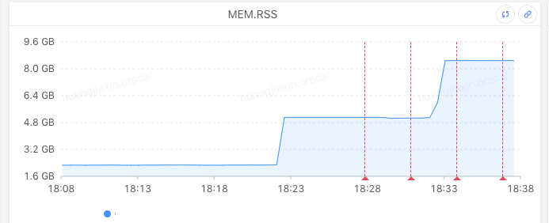
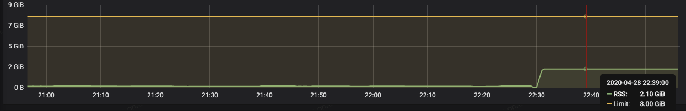
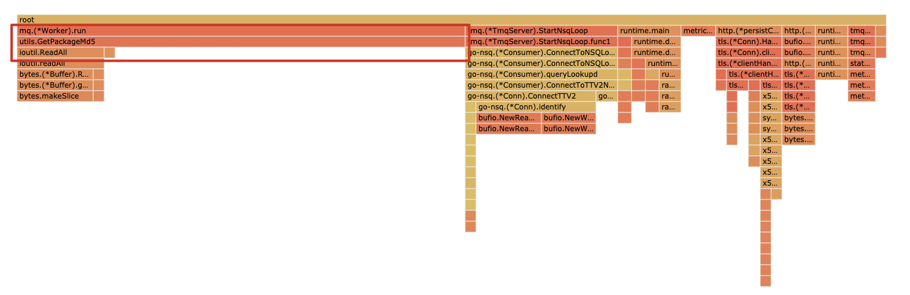
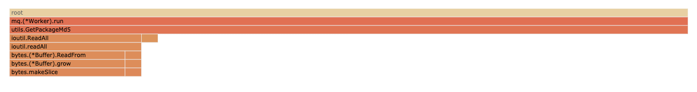
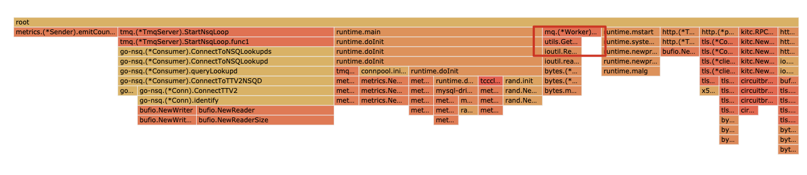
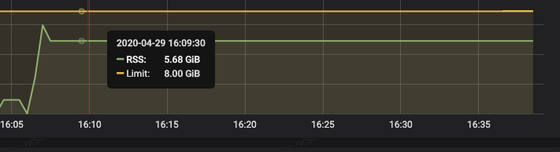

# 背景
在一个服务上线一个commmit时，出现一部分机器OOM的现象

表现为OOM机器内存使用从上线时的2G左右上涨超过8G。

# 排查
通过pprof观察在线上机器运行原服务和提交的新服务的内存使用情况
## 提交的新服务
在服务器上跑提交的新服务。内存使用从147MB增长为2.1GB

## 原服务
在服务器上运行带pprof的原服务，内存在上线后无上涨。
分析程序inuse_space各个函数占比如图

通过以上两图对比可以发现utils.GetPackageMd5的内存分配占比大大增加，分析代码，原因是因为在utils.GetPackageMd5分配了大块内存存储了下载的包。
提交的新服务内存上涨很大情形
与提交的新服务内存分配图相比utils.GetPackageMd5占用内存更大，说明utils.GetPackageMd5占用内存增加是内存上涨的主要原因。最可能原因是下载的包很大，导致utils.GetPackageMd5分配的内存更大

通过在代码中添加下载解析2G包协程的情况
上线后发现内存相较新服务上线的2G左右上涨到5.7G，且因为下载时间比较长，导致内存占用很大。这说明大包下载是内存暴涨的主要原因，也是导致OOM的原因。

# 结论
OOM原因是多个大包的同时下载导致大块内存分配，内存不够时将OOM