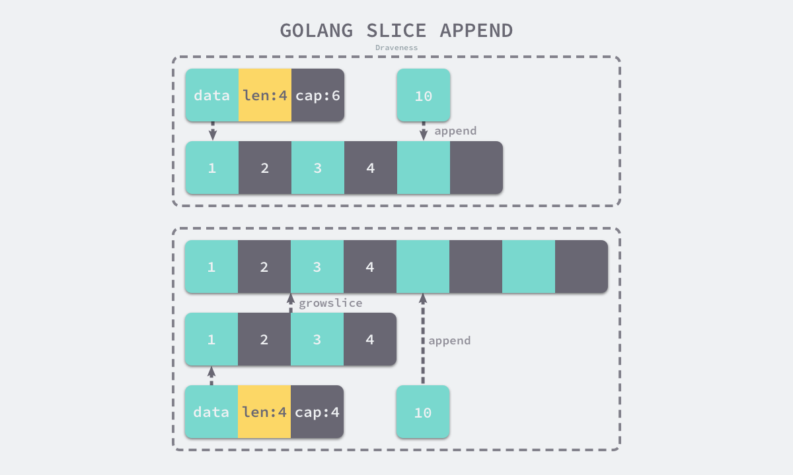

# Go基础

> 参考资料来源<br>
[go语言设计与实现](https://draveness.me/golang/docs/)<br>


**1. map，slice是怎么实现的?**
> 参考[go语言设计与实现](https://draveness.me/golang/docs/)
- go传参时永远是值传递
- array实现
    - array数据结构
    ```go
    type Array struct {
        Elem  *Type // element type
        Bound int64 // number of elements; <0 if unknown yet
    }
    ```
- slice
    - 三种初始化方式
        - 下标
            ```go
            arr := [3]int{1, 2, 3}
            slice := arr[0:1]
            ```
        - 字面量
            ```
            slice := []int{1, 2, 3}
            ```
        - 
    - slice的数据结构
    ```go
    type slice struct {
        array unsafe.Pointer
        len   int
        cap   int
    }
    ```
    - slice的扩容。
        - 如果期望容量大于当前容量的两倍就会使用期望容量；
        - 如果当前切片的长度小于 1024 就会将容量翻倍；
        - 如果当前切片的长度大于 1024 就会每次增加 25% 的容量，直到新容量大于期望容量；
    - slice append元素
        - 切片容量不足时需扩容，否则直接赋值即可
        
- 哈希表
    - 核心数据结构为hmap和bmap
    
    - 访问操作如何寻址
    
    - 写入
        - for循环遍历正常桶和溢出桶，如存在key，则g更新val。不存在，则通过移动内训，插入新key和新val
    - 扩容
        - 当装载因子超过6.5或者哈希使用了太多溢出桶，就会发生扩容。
        - 等量扩容(sameSizeGrow)和增量扩容。sameSizeGrow 是一种特殊情况下发生的扩容，当我们持续向哈希中插入数据并将它们全部删除时，如果哈希表中的数据量没有超过阈值，就会不断积累溢出桶造成缓慢的内存泄漏。
        - 扩容过程
            - 创建2倍大小的新buckets数组，当前buckets指针赋给oldbuckets
            - 在写入过程中，旧桶元素会分流到新桶中(1旧桶->2新桶)，若写入元素不存在，该写入元素会写入新桶
            - 扩容过程中，访问元素，若元素没有分流，仍访问旧桶
            - 增加哈希的 nevacuate 计数器并在所有的旧桶都被分流后清空哈希的 oldbuckets 和 oldoverflow。
        - 删除操作
            - 删除若碰上分流，先完成分流，然后在新桶中完成键值对的删除

- 字符串
    - 数据结构
        ```go
        type StringHeader struct {
            Data uintptr
            Len  int
        }
        ```
**2. map和slice并发访问的安全性问题**
- 均并发不安全。解决办法为
    - slice可使用sync.Mutex加锁
    - map可使用sync.Mutex加锁或者sync.Map


**3. go里面的几种锁和原子变量怎么用，怎么实现的？**
- 基本原语
    - sync.Mutex。基本方法有Lock和Unlock.
    - sync.RWMutex。不限制读并发，读写互斥或者写写互斥。写操作使用 sync.RWMutex.Lock 和 sync.RWMutex.Unlock 方法；
读操作使用 sync.RWMutex.RLock 和 sync.RWMutex.RUnlock 方法；
    - sync.WaitGroup。sync.WaitGroup 可以等待一组 Goroutine 的返回，一个比较常见的使用场景是批量发出 RPC 或者 HTTP 请求。
    - sync.Once, 可确保某个方法只被调用一次。
    - sync.Cond 不是一个常用的同步机制，但是在条件长时间无法满足时，与使用 for {} 进行忙碌等待相比，sync.Cond 能够让出处理器的使用权，提高 CPU 的利用率。使用时我们也需要注意以下问题：
        - sync.Cond.Wait 在调用之前一定要使用获取互斥锁，否则会触发程序崩溃；
        - sync.Cond.Signal 唤醒的 Goroutine 都是队列最前面、等待最久的 Goroutine；
        - sync.Cond.Broadcast 会按照一定顺序广播通知等待的全部 Goroutine


**4. Golang并发机制以及它所使用的CSP并发模型．**
- CSP模型是指用于描述两个独立的并发实体通过共享的通讯 channel(管道)进行通信的并发模型
- Golang的CSP并发模型，是通过Goroutine和Channel来实现的。
    - Goroutine 是Go语言中并发的执行单位。有点抽象，其实就是和传统概念上的”线程“类似，可以理解为”线程“。
    - Channel是Go语言中各个并发结构体(Goroutine)之前的通信机制。通常Channel，是各个Goroutine之间通信的”管道“，有点类似于Linux中的管道。通信机制channel也很方便，传数据用 channel <- data，取数据用 <-channel。在通信过程中，传数据 channel <- data和取数据 <-channel必然会成对出现，因为这边传，那边取，两个goroutine之间才会实现通信。而且不管是传还是取，肯定阻塞，直到另外的goroutine传或者取为止。

**5. 协程与进程，线程区别**
- 进程
    - 进程是具有一定独立功能的程序关于某个数据集合上的一次运行活动,进程是系统进行资源分配和调度的一个独立单位。
    - 每个进程都有自己的独立内存空间，不同进程通过进程间通信来通信。由于进程比较重量，占据独立的内存，所以上下文进程间的切换开销（栈、寄存器、虚拟内存、文件句柄等）比较大，但相对比较稳定安全。

- 线程
    - 线程是进程的一个实体,线程是内核态,而且是CPU调度和分派的基本单位,它是比进程更小的能独立运行的基本单位.线程自己基本上不拥有系统资源,只拥有一点在运行中必不可少的资源(如程序计数器,一组寄存器和栈),但是它可与同属一个进程的其他的线程共享进程所拥有的全部资源。
    - 线程间通信主要通过共享内存，上下文切换很快，资源开销较少，但相比进程不够稳定容易丢失数据。

- 协程
    - 协程是一种用户态的轻量级线程，协程的调度完全由用户控制。协程拥有自己的寄存器上下文和栈。
    - 协程调度切换时，将寄存器上下文和栈保存到其他地方，在切回来的时候，恢复先前保存的寄存器上下文和栈，直接操作栈则基本没有内核切换的开销，可以不加锁的访问全局变量，所以上下文的切换非常快

**6. golang GC**
- GC的意义
    - 解决因忘记清理不使用的内存区域造成的内存泄漏，避免业务无关的内存申请释放造成的开发负担
    - C/C++存由程序员管理， Java/Python/Go等语言均有垃圾回收机制
    - 无GC的语言一般采用内存泄漏检测工具来辅助检测。C++使用智能指针来解决程序员管理内存的问题
- GC常用算法
    - 引用计数
        - 对每个对象维护一个引用计数。当引用计数减为0时，清理对象。存在循环引用问题、频繁更新引用计数降低性能。
    - 标记清除
        - 标记-清除（mark and sweep）分为两步，标记从根变量开始迭代得遍历所有被引用的对象，对能够通过应用遍历访问到的对象都进行标记为“被引用”；标记完成后进行清除操作，对没有标记过的内存进行回收（回收同时可能伴有碎片整理操作）。回收同时可能伴有碎片整理操作。
    - 标记整理
        - 算法分为”标记-整理-清除“阶段，首先需要先标记出存活的对象，然后把他们整理到一边，最后把存活边界外的内存空间都清除一遍。这个算法的好处就是不会产生内存碎片，但是由于整理阶段移动了对象，所以需要更新对象的引用。
    - 标记复制
        - 算法分标记-复制两个阶段。首先会标记存活的对象，完成后，该算法会把存活的对象都复制到一块新的空内存里去。最后将原来的内存空间清空。
    - 分代回收
        - java的jvm 就使用的分代回收的思路。在面向对象编程语言中，绝大多数对象的生命周期都非常短。分代收集的基本思想是，将堆划分为两个或多个称为代（generation）的空间。
        - 新创建的对象存放在称为新生代。新生代垃圾回收的速度非常快，比老年代快几个数量级。
        - 随着垃圾回收的重复执行，生命周期较长的对象会被提升（promotion）到老年代中


- Golang GC
> [Golang垃圾回收](https://draveness.me/golang/docs/part3-runtime/ch07-memory/golang-garbage-collector/)
    - “非分代的、非移动的、并发的、三色的”标记清除垃圾回收算法。
    - go1.4及以前会有STW, go1.5通过三色标记清扫法与写屏障来减少 STW 的时间.
    - gc的过程一共分为四个阶段：
        - 栈扫描（开始时STW），所有对象最开始都是白色.
        - 从 root开始找到所有可达对象（所有可以找到的对象)，标记为灰色，放入待处理队列。
        - 遍历灰色对象队列，将其引用对象标记为灰色放入待处理队列，自身标记为黑色。(BFS的味道)
        - 清除（并发） 循环步骤3直到灰色队列为空为止，此时所有引用对象都被标记为黑色，所有不可达的对象依然为白色，白色的就是需要进行回收的对象。
    - 三色标记法相对于普通标记清扫，减少了 STW 时间. 这主要得益于标记过程是 "on-the-fly" 的，在标记过程中是不需要 STW 的，它与程序是并发执行的，这就大大缩短了STW的时间.
    - 写屏障:这就需要用到屏障技术，golang采用了写屏障，其作用就是为了避免误清扫问题. 写屏障即在内存写操作前，维护一个约束，从而确保清扫开始前，黑色的对象不能引用白色对象.
- GC的触发条件。两种形式
    - 主动触发(手动触发)，通过调用runtime.GC 来触发GC，此调用阻塞式地等待当前GC运行完毕.
    - 被动触发，分为两种方式：
        - 使用系统监控，当超过两分钟没有产生任何GC时，强制触发GC.
        - 使用步调（Pacing）算法，其核心思想是控制内存增长的比例,当前内存分配达到一定比例则触发.


**11. Golang中常用的并发模型**

有三种。
- 通过channel通知实现并发控制。
    ```
    func main() {
        ch := make(chan struct{})
        go func() {
            fmt.Println("start working")
            time.Sleep(time.Second * 1)
            ch <- struct{}{}
        }()

        <-ch

        fmt.Println("finished")
    }
    ```
- 通过sync包中的WaitGroup实现并发控制。它会等待它收集的所有 goroutine 任务全部完成。同一个WaitGroup如何在多个goroutine中共用？
    - WaitGroup类型作为参数传递时应作为指针类型传递。
    - 将匿名函数中的 wg 的传入参数去掉，因为Go支持闭包类型，在匿名函数中可以直接使用外面的 wg 变量.
    ```
    func main(){
        var wg sync.WaitGroup
        var urls = []string{
            "http://www.golang.org/",
            "http://www.google.com/",
        }
        for _, url := range urls {
            wg.Add(1)
            go func(url string) {
                defer wg.Done()
                http.Get(url)
            }(url)
        }
        wg.Wait()
    }
    ```
- 在Go 1.7 以后引进的强大的Context上下文，实现并发控制.

**12. Go context.Context详解**
- context是包括一个程序的运行环境、现场和快照等。每个程序要运行时，都需要知道当前程序的运行状态，通常Go 将这些封装在一个 Context 里，再将它传给要执行的 goroutine 。context 包主要是用来处理多个 goroutine 之间共享数据，及多个 goroutine 的管理。
    ```
    // A Context carries a deadline, cancelation signal, and request-scoped values
    // across API boundaries. Its methods are safe for simultaneous use by multiple
    // goroutines.
    type Context interface {
        // Done returns a channel that is closed when this `Context` is canceled
        // or times out.
        // Done() 返回一个只能接受数据的channel类型，当该context关闭或者超时时间到了的时候，该channel就会有一个取消信号
        Done() <-chan struct{}

        // Err indicates why this Context was canceled, after the Done channel
        // is closed.
        // Err() 在Done() 之后，返回context 取消的原因。
        Err() error

        // Deadline returns the time when this Context will be canceled, if any.
        // Deadline() 设置该context cancel的时间点
        Deadline() (deadline time.Time, ok bool)

        // Value returns the value associated with key or nil if none.
        // Value() 方法允许 Context 对象携带request作用域的数据，该数据必须是线程安全的。
        Value(key interface{}) interface{}
    }
    ```
- `context.Background()`和`context.TODO()`底层都是emptyCtx
- `WithCancel`, `WithDeadline`, 和`WithTimeout`
    - 三者都会返回cancel函数，调用该cancel函数，此context.Done()可收到一个信号
    - `WithDeadline`入参包含deadline时间，当deadline时间到达时或者cancel()被调用时，此context.Done()可收到一个信号。context.Deadline()可取到deadline。
    - `WithTimeout`入参包含超时时间, 当超时时间过去或者cancel()被调用时，此context.Done()可收到一个信号, context.Deadline()可取到deadline。

**12. golang内存逃逸**
- golang程序变量会携带有一组校验数据，用来证明它的整个生命周期是否在运行时完全可知。如果变量通过了这些校验，它就可以在栈上分配。否则就说它 逃逸 了，必须在堆上分配。
- 能引起变量逃逸到堆上的典型情况：
    - **在方法内把局部变量指针返回** 局部变量原本应该在栈中分配，在栈中回收。但是由于返回时被外部引用，因此其生命周期大于栈，则溢出。
    - **发送指针或带有指针的值到 channel 中**。 在编译时，是没有办法知道哪个 goroutine 会在 channel 上接收数据。所以编译器没法知道变量什么时候才会被释放。
    - 在一个切片上存储指针或带指针的值。 一个典型的例子就是 []*string 。这会导致切片的内容逃逸。尽管其后面的数组可能是在栈上分配的，但其引用的值一定是在堆上。
    - slice 的背后数组被重新分配了，因为 append 时可能会超出其容量( cap )。 slice 初始化的地方在编译时是可以知道的，它最开始会在栈上分配。如果切片背后的存储要基于运行时的数据进行扩充，就会在堆上分配。
    - 在 interface 类型上调用方法。 在 interface 类型上调用方法都是动态调度的 —— 方法的真正实现只能在运行时知道。想像一个 io.Reader 类型的变量 r , 调用 r.Read(b) 会使得 r 的值和切片b 的背后存储都逃逸掉，所以会在堆上分配。


