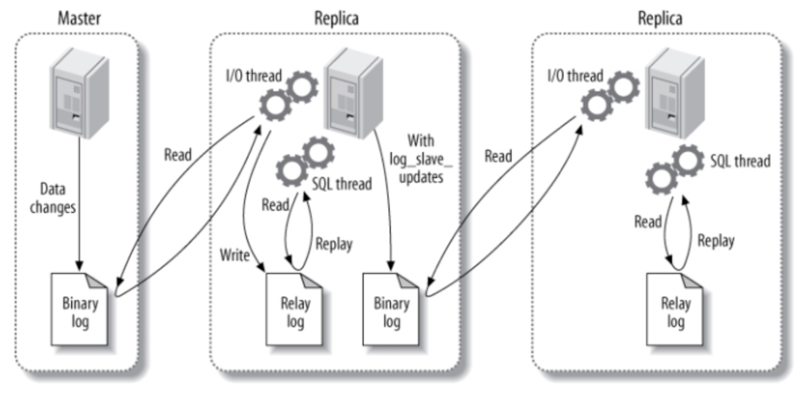
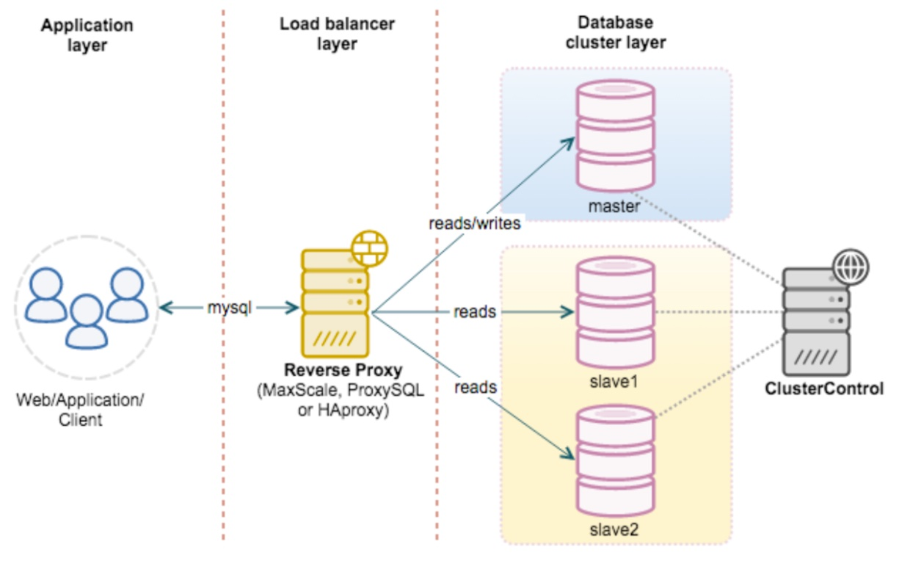

# mysql

> [mysql经典36问](https://mp.weixin.qq.com/s/vSUQ2d0wo4mu7C-euzImYw)

**1. sql语句的执行过程**
- 查询语句。`口诀: 连查析优执(连查西游志)`
    - mysql可分为Server层和存储引擎层。如下图
        - Server 层包括连接器、查询缓存、分析器、优化器、执行器等，涵盖 MySQL 的大多数核心服务功能，以及所有的内置函数（如日期、时间、数学和加密函数等），所有跨存储引擎的功能都在这一层实现，比如存储过程、触发器、视图等。
        - 存储引擎层负责数据的存储和提取。是插件式的，有innodb, myisam, memory等
    
    - 执行流程
        - 连接器。管理连接的客户端，进行权限验证
        - 查询缓存，之前查询语句和结果以key-value存储在缓存中。
            - 不建议使用。原因是更新语句很容易使查询缓存失效。mysql8.0无查询缓存
        - 分析器
            - 词法分析。识别字符串是什么，代表什么
            - 语法分析。分析语句是否符合mysql语法
        - 优化器
            - 生成执行计划。如何选择索引，join表时决定表的连接顺序
        - 执行器
            - 判断对表是否有查询权限
            - 打开表执行查询

- 更新语句。`口诀: redo临时顺序记修改，binlog追加逻辑复丢失`
    - 与查询语句在server层的过程类似。执行过程涉及到日志模块的操作
    - redo log
        - 类似孔乙己掌柜的粉板(redo log)和账本(数据库)。先写redo log，再更新内存。将随机磁盘写变为顺序磁盘写。同时保证了异常重启数据不丢能力。
        - innodb独有。
        - 物理日志，记录某个数据页做了什么修改。避免每次update直接随机访问磁盘数据
    - binlog
        - 逻辑日志。直接追加语句。具有恢复任何时刻数据的能力
        - binlog如何恢复数据库任意时间点的数据
            - 找到该时间点前一次的备份
            - 重放从该备份时间点到该时间点的binlog
    - 更新语句中log的修改如下图。两阶段提交保证了redolog和binlog的一致性。
    

        
**2. 事务隔离级别**

四大隔离级别。默认隔离级别为读提交。`口诀：未读已读重复串`
- 读未提交。两个事务，一个事务的修改即使未提交也能被另一个事务看到
- 读已提交。两个事务，一个事务的修改只有在他提交之后才能被另一个事务看到
- 可重复读。除了读提交之外，两个同时进行的事务，所看到的数据仅限于自己开启事务时的数据和自己所做的修改
- 串行化。两同时进行的事务，哪个事务先加锁，另一个事务加锁就可能被阻塞(读锁和读锁之间不会冲突，其他都会)。

事务启动的时间是在begin之后的第一个语句。

事务隔离级别的实现原理(MVCC机制)。
- 每行记录有多个视图，由每一行的undo log可以从最新值推出过去的每个视图。视图数组保存到当前还在执行的最早视图
- 事务启动时，对于这个事务接下来的操作，所有数据的可见性已经确定。
- 一行记录数据版本可见性判断(可重复读)。对于当前事务的启动瞬间来说，一个数据版本的 row trx_id，有以下几种可能：
    - 如果落在绿色部分，表示这个版本是已提交的事务或者是当前事务自己生成的，这个数据是可见的；
    - 如果落在红色部分，表示这个版本是由将来启动的事务生成的，是肯定不可见的；
    - 如果落在黄色部分，那就包括两种情况a. 若 row trx_id 在数组中，表示这个版本是由还没提交的事务生成的，不可见；b. 若 row trx_id 不在数组中，表示这个版本是已经提交了的事务生成的，可见。

- 注意当前读。如果一个事务先update然后select或者select for update，那么就会获取最新数据然后write/read.


**3. 索引**
- 索引模型
    - 哈希表。适合只有等值查询的场景。nosql, memory引擎支持
    - 有序数组。适合静态存储引擎，即数据不会修改
    - B+树(数据全在叶子结点)。每个叶子结点是一个page（4KB）。等值查询和区间查询效率都很高。多数引擎都支持。
- 主键索引与非主键索引的查询
    - 主键索引叶子结点value就是数据结点，非主键索引叶子结点是value为主键值。非主键索引查询时需要经过回表
- 常见索引名词解释
    - 聚簇与非聚簇索引。聚簇索引的叶子结点是数据结点，聚簇索引的顺序是数据在硬盘上的物理顺序。主键索引一定是聚簇索引
    - 唯一索引(unique key)，是在表上一个或者多个字段组合建立的索引，这个组合在表中不可以重复
    - 主键索引与二级索引。一个标上非主键的索引都是二级索引，叶子结点为主键值
    - 单列索引与联合索引。联合索引是多个字段为索引结点的key， 一般有顺序。联合索引适合索引中多个字段一起查询很频繁的情况
        - 联合索引字段顺序原则。第一原则是，如果通过调整顺序，可以少维护一个索引，那么这个顺序往往就是需要优先考虑采用的。
        - 索引下推。是指在联合索引中决定是否回表时会先进行字段检查
            - 减少了回表查主键索引的次数，从而减少了IO

**4. 锁**

分为全局锁、表锁、行锁。
- 全局锁(flush tables with read lock, FTWRL)。全局锁的使用场景是，做全库逻辑备份
    - 对于全部是 InnoDB 引擎的库，我建议你选择使用– single-transaction 参数
- 表级别锁
    - 表锁。`lock tables … read/write`
    - 元数据锁(MDL)。在增删查改时加上MDL读锁，在增加修改删除表的字段时，加MDL写锁。如果多个线程申请MDL锁，申请MDL锁的操作会形成一个队列，队列中写锁获取优先级高于读锁。一旦出现写锁等待，不但当前操作会被阻塞，同时还会阻塞后续该表的所有操作。事务一旦申请到MDL锁后，直到事务执行完才会将锁释放。
- 行锁
    - 行锁在引擎层实现，myisam不支持行锁
    - InnoDB事务中，行锁需要时才加上，释放是在事务结束时才释放。
    - 如果你的事务中需要锁多个行，要把最可能造成锁冲突、最可能影响并发度的锁尽量往后放。
    - MySQL InnoDB支持三种行锁定方式：
    > [间隙锁](https://segmentfault.com/a/1190000040198549)
        - 行锁(Record Lock):锁直接加在索引记录上面，锁住的是key。
        - 间隙锁(Gap Lock):锁定索引记录间隙，确保索引记录的间隙不变。相当于在行间隙的上或下加锁。这样就不能随便加锁。
        - Next-Key Lock ：行锁和间隙锁组合起来就叫Next-Key Lock
默认情况下，InnoDB工作在可重复读隔离级别下，并且会以Next-Key Lock的方式对数据行进行加锁，这样可以有效防止幻读的发生。
    - 死锁。由于事务加锁是在事务结束时释放，多个事务并发时有可能产生死锁。
        - 请求锁超时放弃。设置innodb_lock_wait_timeout
        - 死锁检测。设置 innodb_deadlock_detect。死锁检测为O(n^2)，易导致CPU占用高。
            - 控制并发度
            - 业务上保证无死锁
            - 一行改成逻辑多行

**6. 性能优化**

- explain语句详解[mysql explain](https://dev.mysql.com/doc/refman/8.0/en/explain-output.html)
- 参见[全面 MySQL 性能优化实践](https://segmentfault.com/a/1190000039733895)

**7. 切分(分库分表)**
- 切分目的？
    - 当数据量非常大时，一个数据库在一台机器上，会限制数据库的并发量，无法满足业务要求。
- 切分分类
    - 水平切分。将不同记录分到不同机器的数据库中
    - 垂直切分。通常是按照列的关系密集程度进行切分，也可以利用垂直切分将经常被使用的列和不经常被使用的列切分到不同的表中。

- 切分策略(水平切分)
    - 哈希取模:hash(key) % N;
    - 范围:可以是 ID 范围也可以是时间范围; 映射表:使用单独的一个数据库来存储映射关系。
    - 映射表:使用单独的一个数据库来存储`sharding key`和库映射关系。

- 切分存在的问题。参考[分库与分表带来的分布式困境与应对之策](http://blog.720ui.com/2017/mysql_core_09_multi_db_table2/)
    - 事务问题
        - 使用分布式事务来解决，比如 XA 接口。
    - 连接问题
        - 可以将原来的连接分解成多个单表查询，然后在用户程序中进行连接。
    -  ID 唯一性
        - 使用全局唯一 ID(GUID)
        - 为每个分片指定一个 ID 范围
        - 分布式 ID 生成器 (如 Twitter 的 Snowflake 算法)
**8. 复制**
- 主从复制
    - 读可移到从服务器，减轻压力。

- 读写分离
    - 主写从读，性能高。



**9. mysql如何实现事务的ACID性质**
- 事务的ACID性质说明
    - 原子性（Atomicity），即事务最终的状态只有两种，全部执行成功和全部不执行。
    - 一致性（Consistency），是指事务操作前和操作后，数据的完整性保持一致或满足完整性约束。比如，用户 A 和用户 B 在银行分别有 800 元和 600 元，总共 1400 元，用户A 给用户 B 转账 200 元，则必须保证A减少200， B增加200。
    - 隔离性（Isolation），是指当系统内有多个事务并发执行时，多个事务不会相互干扰，即一个事务内部的操作及使用的数据，对其他并发事务是隔离的。
    - 持久性（Durability），也被称为永久性，是指一个事务完成了，那么它对数据库所做的更新就被永久保存下来了。
- 事务ACID性质如何实现
    - 通过`begin, commit, rollback`等命令实现原子性
    - 通过mvcc多版本并发控制实现隔离性
    - 通过mysql的redo log和binlog实现持久性

**10. 使用mysql中遇到的问题**
- 长事务导致mysql拖垮
    - 占有锁资源，可能拖垮整个库 
    - 长事务可能导致暂时需要保存很多undo log，会占用内存空间。

**11. 自增主键的使用场景**
自增主键优势
- 二级索引叶子结点是主键值，使用自增主键可以省空间
- 自增主键插入数据，发生结点分裂的频率低，有性能优势

什么情况下使用列作为主键
- 该列是唯一的
- 该列是唯一索引

**12.分页查询时如果页码较深会有什么影响？如何解决**
- 分页查询sql, `select * from table where col1=val1 limit A, B`
- sql分页查询会产生A次回表，回表比较耗时
- 优化办法
    - select需要的字段，这些字段使用覆盖索引
    - 如果id为自增主键，且无间隙，可使用`select * from table where id >= (select id from table where col1=val1 limit A, 1) limit B`
    - 利用join, `SELECT * FROM product a 
JOIN (select id from product limit 866613, 20) b ON a.ID = b.id`, 不用回表。

**13.sql语句的执行顺序**
> [Order of execution of a Query](https://sqlbolt.com/lesson/select_queries_order_of_execution)
```
SELECT DISTINCT column, AGG_FUNC(column_or_expression), …
FROM mytable
    JOIN another_table
      ON mytable.column = another_table.column
    WHERE constraint_expression
    GROUP BY column
    HAVING constraint_expression
    ORDER BY column ASC/DESC
    LIMIT count OFFSET COUNT;
```
1. FROM and JOINs
2. WHERE
3. GROUPBY
4. HAVING
5. SELECT
6. DISTINCT
7. ORDER BY
8. LIMIT/OFFSET 

**14. exist和in的区别？**
- exists用于对外表记录做筛选。exists会遍历外表，将外查询表的每一行，代入内查询进行判断。当exists里的条件语句能够返回记录行时，条件就为真，返回外表当前记录。反之如果exists里的条件语句不能返回记录行，条件为假，则外表当前记录被丢弃。
    ```
    select a.* from A awhere exists(select 1 from B b where a.id=b.id)
    ```
- in是先把后边的语句查出来放到临时表中，然后遍历临时表，将临时表的每一行，代入外查询去查找。
    ```
    select * from Awhere id in(select id from B)
    ```
- 子查询的表比较大的时候，使用exists可以有效减少总的循环次数来提升速度；当外查询的表比较大的时候，使用in可以有效减少对外查询表循环遍历来提升速度。

**15. truncate、delete与drop区别？**
- 相同点：
    - truncate和不带where子句的delete、以及drop都会删除表内的数据。
    - drop、truncate都是DDL语句（数据定义语言），执行后会自动提交。
- 不同点：
    - truncate 和 delete 只删除数据不删除表的结构；drop 语句将删除表的结构被依赖的约束、触发器、索引；
    - 一般来说，执行速度: drop > truncate > delete。