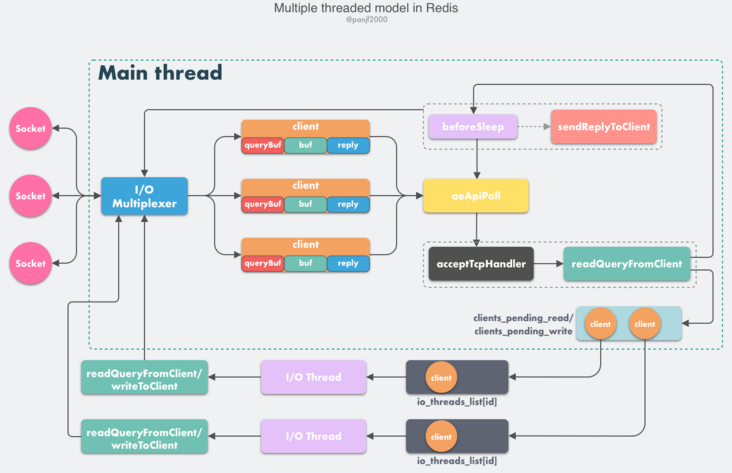
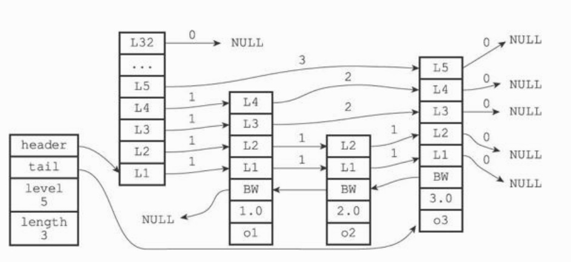

# Redis

**1.redis是什么**
一个基于内存的高性能 Key-Value 数据库
**2.redis优缺点**
- 优点
    - 纯内存操作，速度快， 10w qps
    - 支持丰富数据类型，包括String ，List，Set，Sorted Set，Hash基础数据结构，也有 Bitmap、HyperLogLog、GEO这些高级数据结构
    - 丰富特性
        - 订阅发布 Pub / Sub 功能
        - Key 过期策略
        - 事务
        - 支持多个 DB
        - 计数
    - 持久化存储
        - Redis 提供 RDB 和 AOF 两种数据的持久化存储方案，解决内存数据库宕机数据丢失的问题
    - 高可用
        - 内置 Redis Sentinel ，提供高可用方案，实现主从故障自动转移。
        - 内置 Redis Cluster ，提供集群方案，实现基于槽的分片方案，从而支持更大的 Redis 规模。
- 缺点
    - Redis是内存数据库，因此需要预估和节约内存。
    - 部分情况下，进行完整重同步时，由于需要生成 RDB 文件，并进行传输，会占用主机的 CPU ，并会消耗现网的带宽。

**3.redis与memcached区别**

memcached已经没落了
- Redis 支持复杂的数据结构
    - Memcached 仅提供简单的字符串。Redis 提供复杂的数据结构，丰富的数据操作。
- Redis 原生支持集群模式，Memcached 没有原生的集群模式，需要依靠客户端来实现往集群中分片写入数据。
- redis在大规模数据上性能略差，小规模数据性能优，redis只使用单核。
- 内存管理机制不同
    - Redis 采用的是包装的 malloc/free ，使用时现场申请的方式。Memcached 采用的是 Slab Allocation 机制管理内存，预分配的内存池的方式。
-  网络 IO 模型
    - Memcached 是多线程，非阻塞 IO 复用的网络模型。Redis 使用单线程的 IO 复用模型，自己封装了一个简单的 AeEvent 事件处理框架，主要实现了 epoll ， kqueue 和 select。
- 持久化存储
    - Memcached 不支持，Redis 支持


**4.redis 服务端网络请求处理模型**
reactor模型。
- 从 Redis 的 v1.0 到 v6.0 版本之前， 是一个单reactor模型，利用 epoll/select/kqueue 等多路复用技术，在单线程的事件循环中不断去处理事件（客户端请求），最后回写响应数据到客户端。
    
- v6.0之后，引入多线程之后会进化为 Multi-Reactors 模式

    - 大部分逻辑和之前的单线程模型是一致的，变动的地方仅仅是把读取客户端请求命令和回写响应数据的逻辑异步化了，交给 I/O 线程去完成，这里需要特别注意的一点是：I/O 线程仅仅是读取和解析客户端命令而不会真正去执行命令，客户端命令的执行最终还是要在主线程上完成。


**5.redis单线程模型为何效率高**
- 避免过多的上下文切换开销
- 避免同步机制的开销
- 纯内存操作，CPU通常不会是瓶颈，瓶颈通常是网络IO
- 简单可维护
**6.redis单线程如何提高多核CPU利用率**
- 在同一个服务器上部署多个redis实例
    - 使用taskset命令将每个实例和CPU内核进行绑定。例如`taskset -pc 3 <redis的pid>`

**7.redis持久化方式**
- RDB持久化
    - RDB文件用于保存和还原Redis服务器所有数据库中的所有键值对数据。RDB文件是一个经过压缩的二进制文件，由多个部分组成。
    - SAVE命令由服务器进程直接执行保存操作，所以该命令会阻塞服务器。BGSAVE令由子进程执行保存操作，所以该命令不会阻塞服务器。
    - 服务器状态中会保存所有用save选项设置的保存条件，当任意一个保存条件被满足时，服务器会自动执行BGSAVE命令。
- AOF持久化
    - AOF持久化是通过保存Redis服务器所执行的写命令来记录数据库状态的。AOF持久化是通过保存Redis服务器所执行的写命令来记录数据库状态的
    - AOF重写可以产生一个新的AOF文件，这个新的AOF文件和原有的AOF文件所保存的数据库状态一样，但体积更小。通过读取现有数据库的键值对实现


**8.redis数据过期策略与内存淘汰策略**
- 数据过期策略
    - 定时过期：每个设置过期时间的key都需要创建一个定时器，到过期时间就会立即清除。内存友好，CPU占用高
    - 惰性过期：只有访问一个key时才判断是否已经过期，过期则清除。内存不友好，节省CPU
    - 定期过期：每隔一定的时间，会扫描一定数量的数据库的expires字典中一定数量的key，并清除其中已过期的key。
    - Redis中同时使用了惰性过期和定期过期两种过期策略。
- 内存淘汰策略
    - 指在Redis的用于缓存的内存不足时，怎么处理需要新写入且需要申请额外空间的数据。
    - noeviction：当内存不足以容纳新写入数据时，新写入操作会报错。
    - allkeys-lru：当内存不足以容纳新写入数据时，在键空间中，移除最近最少使用的key。
    - allkeys-random：当内存不足以容纳新写入数据时，在键空间中，随机移除某个key。
    - volatile-lru：当内存不足以容纳新写入数据时，在设置了过期时间的键空间中，移除最近最少使用的key。
    - volatile-random：当内存不足以容纳新写入数据时，在设置了过期时间的键空间中，随机移除某个key。
    - volatile-ttl：当内存不足以容纳新写入数据时，在设置了过期时间的键空间中，有更早过期时间的key优先移除。

**9.redis数据结构与实现原理**
- 常用数据结构
    - string。 底层是SDS动态字符串
    - List。ziplist压缩列表，linkedlist双端链表
    - Hash, hashtable哈希列表，ziplist压缩列表
    - 集合Set，inset整数集合，hashtable哈希表
    - zset, skiplist跳表，ziplist压缩列表
    - HyperLogLog。基数统计，统计unique item的数量
    - Geo。存储地理位置信息的数据结构。
    - BitMap。位图，[Redis 实战篇：巧用 Bitmap 实现亿级数据统计](https://segmentfault.com/a/1190000040177140)
- 实现原理
    - SDS动态字符串。
    
    
    - hashtable哈希列表
    
    - ziplist压缩列表
        - 压缩列表是Redis为了节约内存而开发的，是由一系列特殊编码的连续内存块组成的顺序型（sequential）数据结构。一个压缩列表可以包含任意多个节点（entry），每个节点可以保存一个字节数组或者一个整数值。
    
    
    - skiplist跳表
    
    - inset整数集合
    
    - linkedlist双端列表
    

**10.redis使用场景**
- 数据缓存
    - 作为Key-Value形态的内存数据库，Redis 最先会被想到的应用场景便是作为数据缓存
    - 缓存内容与数据库的一致性，这里一般有两种做法：
        - 只在数据库查询后将对象放入缓存，如果对象发生了修改或删除操作，直接清除对应缓存（或设为过期）。
        - 在数据库新增和查询后将对象放入缓存，修改后更新缓存，删除后清除对应缓存（或设为过期）。
- 会话缓存
    - 缓存登录用户cookie
- 时效性数据
    - list作为双向链表，不光可以作为队列使用。如果将它用作栈便可以成为一个公用的时间轴
- 访问频率
    - 使用zset， timestamp为score，可统计一段时间内的访问用户数
- 计数器
    - 在 Redis 的数据结构中，string、hash和sorted set都提供了incr方法用于原子性的自增操作，下面举例说明一下它们各自的使用场景：
    - 如果应用需要显示每天的注册用户数，便可以使用string作为计数器，设定一个名为REGISTERED_COUNT_TODAY的 key，并在初始化时给它设置一个到凌晨 0 点的过期时间，每当用户注册成功后便使用incr命令使该 key 增长 1，同时当每天凌晨 0 点后，这个计数器都会因为 key 过期使值清零。
    - 每条微博都有点赞数、评论数、转发数和浏览数四条属性，这时用hash进行计数会更好，将该计数器的 key 设为weibo:weibo_id，hash的 field 为like_number、comment_number、forward_number和view_number，在对应操作后通过hincrby使hash 中的 field 自增。
    - 如果应用有一个发帖排行榜的功能，便选择sorted set吧，将集合的 key 设为POST_RANK。当用户发帖后，使用zincrby将该用户 id 的 score 增长 1。sorted set会重新进行排序，用户所在排行榜的位置也就会得到实时的更新。
- 社交列表
    - 如通过set的SUNION功能可以实现求一个与这个用户互相关注的用户
- 热门列表与排行榜
    - 使用sorted set和一个计算热度的算法便可以轻松打造一个热度排行榜，zrevrangebyscore可以得到以分数倒序排列的序列，zrank可以得到一个成员在该排行榜的位置（是分数正序排列时的位置，如果要获取倒序排列时的位置需要用zcard-zrank）
- 消息队列
    - Redis 中list的数据结构实现是双向链表，所以可以非常便捷的应用于消息队列（生产者 / 消费者模型）。消息的生产者只需要通过lpush将消息放入 list，消费者便可以通过rpop取出该消息，并且可以保证消息的有序性。如果需要实现带有优先级的消息队列也可以选择sorted set。而pub/sub功能也可以用作发布者 / 订阅者模型的消息。无论使用何种方式，由于 Redis 拥有持久化功能，也不需要担心由于服务器故障导致消息丢失的情况。
- 分布式锁
    - 由于这个操作是原子性的，可以简单地以此实现一个分布式的锁，例如：`set key "lock" EX 1 XX`。如果这个操作返回false，说明 key 的添加不成功，也就是当前有人在占用这把锁。而如果返回true，则说明得了锁，便可以继续进行操作，并且在操作后通过del命令释放掉锁。并且即使程序因为某些原因并没有释放锁，由于设置了过期时间，该锁也会在 1 秒后自动释放，不会影响到其他程序的运行。


**12.redis如何实现分布式锁**
一般来说，生产环境可用的分布式锁需要满足以下几点：
- 互斥性，互斥是锁的基本特征，同一时刻只能有一个线程持有锁，执行临界操作；
超时释放，超时释放是锁的另一个必备特性，可以对比 MySQL InnoDB 引擎中的 innodb_lock_wait_timeout 配置，通过超时释放，防止不必要的线程等待和资源浪费；
- 可重入性，在分布式环境下，同一个节点上的同一个线程如果获取了锁之后，再次请求还是可以成功；
- 高性能和高可用，加锁和解锁的开销要尽可能的小，同时也需要保证高可用，防止分布式锁失效；
- 支持阻塞和非阻塞性，对比 Java 语言中的 wait() 和 notify() 等操作，这个一般是在业务代码中实现，比如在获取锁时通过 while(true) 或者轮询来实现阻塞操作。

采用setnx命令实现。如果需要阻塞当前进程，可以在一个循环中不断尝试 setnx 操作。
```
if(setnx(key,value, expiretime)==1){
     try{
        //业务处理
     }finally{
       //释放锁
       del(key)
     }
}
```

集群下的分布式锁
假设当前集群有 5 个节点，运行 Redlock 算法的客户端依次执行下面各个步骤，来完成获取锁的操作：
- 客户端记录当前系统时间，以毫秒为单位；
- 依次尝试从 5 个 Redis 实例中，使用相同的 key 获取锁，当向 Redis 请求获取锁时，客户端应该设置一个网络连接和响应超时时间，超时时间应该小于锁的失效时间，避免因为网络故障出现的问题；
- 客户端使用当前时间减去开始获取锁时间就得到了获取锁使用的时间，当且仅当从半数以上的 Redis 节点获取到锁，并且当使用的时间小于锁失效时间时，锁才算获取成功；
- 如果获取到了锁，key 的真正有效时间等于有效时间减去获取锁所使用的时间，减少超时的几率；
- 如果获取锁失败，客户端应该在所有的 Redis 实例上进行解锁，即使是上一步操作请求失败的节点，防止因为服务端响应消息丢失，但是实际数据添加成功导致的不一致。

- 生产场景
  - 在送审重构中，送审策略quota的修改需要使用分布式锁


**13.redis如何实现分布式限流**
- 使用zset可实现一段时间内某个用户只能访问多少次

```
public boolean isActionAllowed(String userId, String actionKey, int period,
    int maxCount) {
    String key = String.format("hist:%s:%s", userId, actionKey); // 使用用户编号 + 行为作为 KEY 。这样，我们就可以统计某个用户的操作行为。
    long nowTs = System.currentTimeMillis(); // 获取当前时间。
    Pipeline pipe = jedis.pipelined(); // pipeline 批量操作，提升效率。
    pipe.multi(); // 此处启动了事务，可以保证指令的原子性。
    pipe.zadd(key, nowTs, "" + nowTs); // zset 添加，key value score 要看下。
    pipe.zremrangeByScore(key, 0, nowTs - (period * 1000)); // zremrangeByScore ，移除超过周期的 value 。

    Response<Long> count = pipe.zcard(key); // zcard ，计算 zset 的数量
    pipe.expire(key, period + 1); // 设置过期。这里多 + 1 秒，为了防止网络延迟。
    pipe.exec(); // pipeline 执行
    pipe.close();

    return count.get() <= maxCount; // 是否超过最大次数。
}
```

**14.如何使用 Redis 实现消息队列？**
- 一般使用 list 结构作为队列，rpush 生产消息，lpop 消费消息。当 lpop 没有消息的时候，要适当 sleep 一会再重试。如果不需要sleep，则可以使用blpop
- 生产一次消费多次。可使用pubsub，如果消费者下线，生产者生产的消息会丢失。

**15. redis 如何实现延时队列**
- 使用 sortedset ，拿时间戳作为 score ，消息内容作为 key 调用 zadd 来生产消息，消费者用 zrangebyscore 指令获取 N 秒之前的数据轮询进行处理

**16.redis事务**
- 在 Redis 中，MULTI / EXEC / DISCARD / WATCH 这四个命令是我们实现事务的基石。redis事务的特性
    - 事务中的所有命令都将会被串行化的顺序执行，且执行期间，不会有其他客户端的请求被执行
    - redis事务执行中间一个命令失败，会继续执行
    - MULTI-开启事务，EXEC-提交事务，DISCARD-回滚事务
- 如何实现 Redis CAS 操作？
    - 在 Redis 的事务中，WATCH 命令可用于提供 CAS(check-and-set) 功能。假设我们通过 WATCH 命令在事务执行之前监控了多个 keys ，倘若在 WATCH 之后有任何 Key 的值发生了变化，EXEC 命令执行的事务都将被放弃，同时返回 nil 应答以通知调用者事务执行失败。
**17.redis pipelining**
未使用 Pipeline 时，那么整个执行的顺序是，req1->resp1->req2->resp2->req3->resp3 。使用pipeline之后，执行顺序变为[req1,req2,req3] -> [resp1,resp2,resp3]。


**17.redis 集群方案, 数据分布，连上一个节点，但数据存储在另一个节点上，数据如何获取**
- redis集群的三种模式
    - 主从模式。主从模式是将数据复制多份分布在多个节点上，一主多从。
        - 主从复制的目的
            - 读写分离，分担master的读压力
            - 方便容灾恢复
        - 主从复制的实现
            - 从机刚上线，全同步
            - 从机掉线重连，2.8之前全同步，之后增量同步
            - 命令传播。主服务器将客户端命令传播给从服务器
        - 主从的优缺点
            - 优点
                - 读写分离减轻 Master 的读操作压力
            - 缺点
                - 主机宕机会导致客户端端部分读写请求失败，需要等待机器重启，客户端才能继续
                - 主机宕机前部分数据未同步到主机，会引入主从数据不一致
                - 主机宕机需要手动将一台从机切换为主机，这个时间段服务不可用
    - 哨兵模式
        - 目的
            - 主从存在主机宕机整个集群无法工作的问题，引入哨兵可将一个从机改为主机，使得集群自动恢复
        - 实现
            - 检查主观下线
            - 询问其他sentinel，当超过特定数目的sentinel确认主观下线时，原master变为客观下线。
            - 选举领头sentinel
            - 将原master中的一个slave选为主服务器，剩余slave成为新master的slave, 原master重新加入时也会成为新master的slave。
    - cluster集群模式
        - 目的
            - 主从和哨兵，在每个节点上都有一份完整的数据，单个机器的内存限制了redis的存储容量
            - redis主从和哨兵只有一个master， 限制了redis的写IO
            - redis集群可以实现分片存储
        - 实现
            - 分片存储的依据是，key的CRC16值&16383得到key的槽号
            - 客户端给连接的节点发起读写请求的key不属于这个节点，服务端节点会返回MOVED错误并且引导客户端像存储这个key的节点发起请求。
- redis cluster部署如何扩缩容
    - 扩容
        - 加入新节点
        - 如果是加入新的主节点。将原先节点上多存的slot重分片到新节点中，通过redis_trib工具完成重分片。
            - `redis-trib.rb add-node`
            - `redis-trib.rb reshard host:port`， 
host:port：随便指定一个集群中的host:port，用以获取全部集群的信息
        - 如果是加入作为其他主节点的从节点，`cluster replicate xxx`
    - 缩容
        - 下线迁移槽
        - 忘记节点。如果忘记的节点有从节点，首先需要删除从节点


**18.redis Hash的rehash，描述渐进式rehash**
- rehash是指redis的hash数据结构在存储数据比较大时需要对哈希表进行扩容，否则会造成频繁的hash冲突
- 渐进式rehash是为了避免一次性rehash对redis对外服务造成性能影响,rehash分多次渐进式完成
- rehash的步骤
    - 为ht[1]分配空间，让字典同时持有ht[0]和ht[1]两个哈希表。
    - 在字典中维持一个索引计数器变量rehashidx，并将它的值设置为0，表示rehash工作正式开始
    - 在rehash进行期间，每次对字典执行添加、删除、查找或者更新操作时，程序除了执行指定的操作以外，还会顺带将ht[0]哈希表在rehashidx索引上的所有键值对rehash到ht[1]，当rehash工作完成之后，程序将rehashidx属性的值增一
    - 随着字典操作的不断执行，最终在某个时间点上，ht[0]的所有键值对都会被rehash至ht[1]，这时程序将rehashidx属性的值设为-1，表示rehash操作已完成。
- rehash期间，服务器执行的查询、修改、删除操作会先查ht[0],找不到在查ht[1]，添加操作会直接添加到ht[1]中

**19. redis 发布订阅的使用**
- PUBLISH channel message, 给指定channel发布消息
- SUBSCRIBE channel [channel ...]， 订阅某个channel的消息
- UNSUBSCRIBE channel， 订阅某个channel的消息
- PSUBSCRIBE, 订阅某个模式的消息
- PUNSUBSCRIBE，解除订阅某个模式的消息
- PUBSUB CHANNELS [pattern]， 列出当前活跃的channels
- PUBSUB NUMPAT，获取有订阅者的模式的数量
- PUBSUB NUMSUB channel，获取指定channel的订阅者数量

**20. redis 事务的实现**

**21. redis Lua脚本的使用示例**

**22. docker部署redis主从, redis主从哨兵, redis集群**
> 参见[docker上部署redis集群](https://www.notion.so/docker-redis-684d67afd33f416daeb92ecc3a2d25df)

**23. redis的大key和热key问题**
- 大key和热key是什么？
    - 大key是单个key的value数据过大
    - 热key是指redis请求qps集中在某些key上
- 大key和热key引发的问题?
    - 大key
        - 会造成客户端执行命令时间过长。
        - 对大key执行读操作，会使得redis带宽拉满，导致服务变慢
        - 对大key执行删除操作，会导致主库阻塞，引发同步中断或者主从切换
        - 集群状态下某个节点内存使用率过高
    - 热key
        - 单节点CPU占用过高，影响节点上其他key的访问
        - 集群架构下，某个数据分片(节点)被大量访问，其他数据分片处于空闲状态，造成该节点访问连接耗尽，被拒绝访问
- 如何发现大key和热key?
    - 大key
        - 通过redis内置命令，如STRLEN, LLEN, HLEN, SCARD, ZCARD, XLEN等命令
        - 通过该`redis-cli *** -bigkeys`去发现大key
    - 热key
        - 业务经验判断
        - 在客户端业务代码里面进行收集
        - 在proxy层收集
        - monitor命令收集或者使用`redis-cli *** -hotkeys`去发现热点key
- 如何优化大key和热key?
    - 大key优化
        - 对大key进行拆分。如将key加上后缀
        - 对大Key进行清理。将不适用Redis能力的数据存至其它存储，并在Redis中删除此类数据。
    - 热key优化
        - 在客户端做本地缓存
        - 读写分离，写请求到master, 读请求到slave。扩充读节点。

**24. redis集群化方案(客户端分片，codis, Twemproxy, redis-cluster)分片redis-proxy架构(Alchamy)？**


    